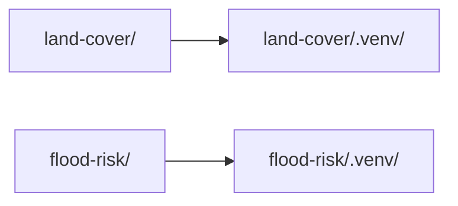
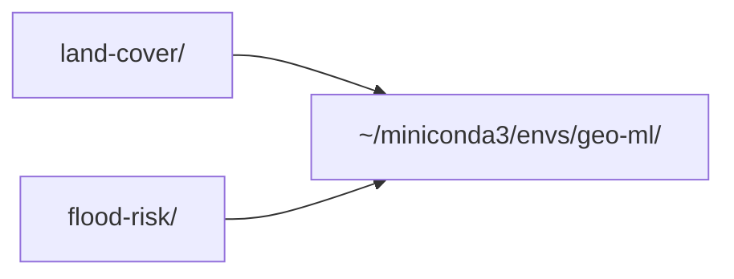
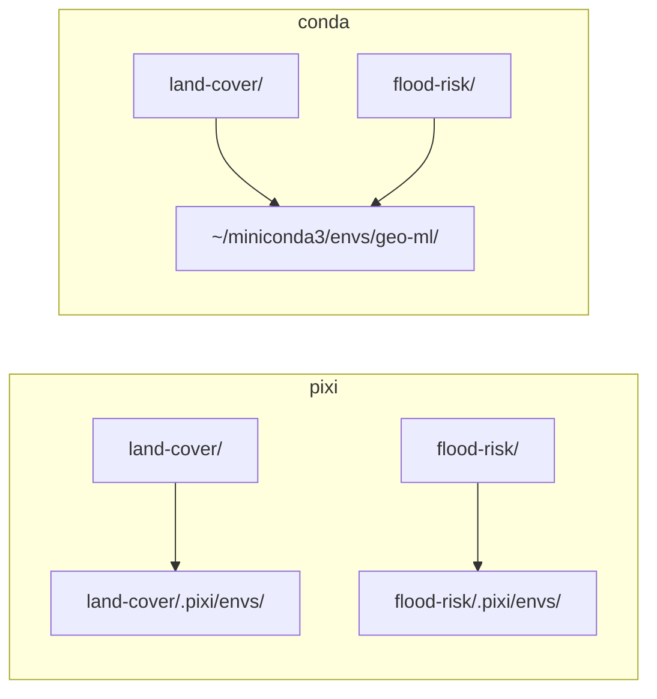
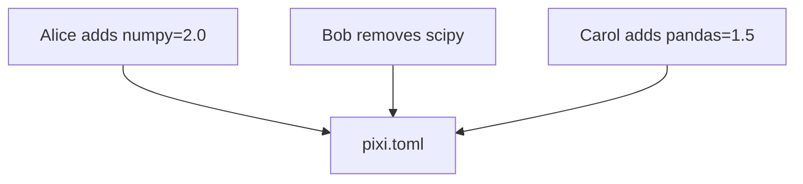

pip has been the default way to install Python packages for over a decade. For pure Python projects, it works well.

But data science and AI projects rarely stay pure Python. They pull in CUDA toolkits for GPU acceleration, OpenCV and FFmpeg for computer vision, and compiled C/C++ libraries for geospatial analysis.

These are system-level dependencies that pip cannot install.

In this article, we'll explore three tools, each adding a layer on top of the previous:

- **conda** creates isolated environments with both Python and non-Python dependencies
- **pixi** adds lockfiles, speed, and a modern developer experience on top of conda-forge
- **nebi** layers version control and team collaboration on top of pixi workspaces

<!-- truncate -->

## The Problem with pip

To make the comparison concrete, we'll set up the same geospatial ML project with each tool. Its dependencies come from two sources:

- **conda-forge**: geopandas and GDAL (compiled C/C++ geospatial libraries) and LightGBM (optimized compiled binaries)
- **PyPI**: scikit-learn (pure Python, pip handles it fine)

pip installs Python code, but it has no mechanism for installing compiled system libraries, header files, or non-Python dependencies.

This becomes a problem with packages like GDAL. `pip install gdal` only downloads Python bindings. If the underlying C/C++ library isn't already installed, the build fails:

```bash
pip install gdal
```

```
Collecting gdal
  Downloading gdal-3.12.2.tar.gz (899 kB)
  Getting requirements to build wheel ... error

  gdal_config_error: No such file or directory: 'gdal-config'
  Could not find gdal-config. Make sure you have installed
  the GDAL native library and development headers.
```

Fixing this means installing GDAL through your OS package manager, then matching the exact version to the pip package:

```bash
# Ubuntu/Debian: install system library + headers
sudo apt-get install -y libgdal-dev gdal-bin
export C_INCLUDE_PATH=/usr/include/gdal
pip install GDAL==$(gdal-config --version)

# macOS: install via Homebrew
brew install gdal
pip install GDAL==$(gdal-config --version)
```

## conda: The Established Default

conda launched in 2012 to solve exactly this problem. It ships pre-compiled binaries with all their system dependencies bundled, so packages like GDAL work across platforms without manual compilation:

```bash
conda install -c conda-forge gdal
```

```
Solving environment: done

The following NEW packages will be INSTALLED:
  gdal            3.11.4   # Python bindings
  libgdal-core    3.11.4   # compiled C/C++ library
  proj            9.7.1    # coordinate system library
  geos            3.10.6   # geometry engine
  geotiff         1.7.4    # GeoTIFF support
  libspatialite   5.1.0    # spatial SQL engine
  xerces-c        3.3.0    # XML parser
  ... and 50+ other compiled dependencies

Total: 72.2 MB
```

We can see that one command pulls in GDAL along with 60+ compiled dependencies, including the C/C++ library, coordinate system tools, and geometry engines.

### Where Environments Live

With pip and virtualenv, environments live inside your project directory:

```bash
python -m venv .venv        # creates ./my-project/.venv/
source .venv/bin/activate
```

conda stores environments in a central directory, separate from your project:

```bash
conda create -n geo-ml python=3.11   # creates ~/miniconda3/envs/geo-ml/
conda activate geo-ml
```

With pip, each project gets its own environment:



With conda, multiple projects can share one central environment:



This makes environments reusable. If you're working on both a land cover classification project and a flood risk analysis, both can share the same `geo-ml` environment rather than installing geopandas and GDAL twice.

However, as projects multiply, this becomes hard to track. Was this project using `geo-ml` or `geo-ml-v2`? Nothing in your project directory answers that question.

### Two Package Managers, One Environment

Instead of PyPI, conda uses its own package repository called conda-forge. conda-forge specializes in pre-compiled packages with system-level dependencies bundled in, but it covers far fewer packages than PyPI.

For everything conda-forge doesn't have, you fall back to pip:

```bash
# conda-forge packages (non-Python dependencies)
conda install -c conda-forge geopandas gdal lightgbm

# PyPI packages for Python-only libraries
pip install scikit-learn
```

This means two package managers modify the same environment independently. conda doesn't know pip installed scikit-learn, and pip doesn't know conda installed numpy. If both install conflicting versions of a shared dependency, neither tool will warn you.

### Sharing Environments with Your Team

To make a project reproducible, you need to share the exact environment used to run it. That includes the precise version of every dependency, from Python packages to compiled system libraries.

conda handles this with `environment.yml`. You export your current environment to a file, commit it to your repo, and teammates use it to recreate the same setup.

To generate the file, run:

```bash
conda env export > environment.yml
```

This generates a file listing every package and its version:

```yaml
name: geo-ml
channels:
  - conda-forge
dependencies:
  - python=3.11.9
  - geopandas=0.14.4
  - gdal=3.8.5
  - lightgbm=4.3.0
  - pip:
    - scikit-learn==1.4.2
```

Unlike a `requirements.txt`, this file captures both conda-forge and pip packages in one place. It also records the channel each package came from, so conda knows where to fetch them during installation.

Once committed to the repo, a teammate can recreate the environment with:

```bash
conda env create -f environment.yml
```

This works, but notice the file only lists packages you explicitly installed. It doesn't pin the 60+ transitive dependencies underneath them.

For example, geopandas depends on proj, geos, and shapely, but their versions aren't recorded. Running `conda env create` next month may pull newer versions of those libraries, silently changing behavior.

### Good Practices That Aren't Enforced

conda works well when you follow a set of unwritten rules:

- **Always create a named environment before installing anything.** Otherwise packages land in the always-active base environment, where they accumulate and conflict with project environments over time.
- **Never mix conda and pip install order.** conda can't track what pip installed. If you install pip packages first, a later `conda install` may overwrite them without warning.
- **Re-export `environment.yml` after every change.** Forget once, and the file your teammates rely on no longer matches the actual environment.

These rules exist because conda doesn't automate what it should. The best tools make good practices the default, not something you have to remember.

pixi was designed around that idea.

## pixi: Modern Environment Management

pixi, built in Rust by prefix-dev, takes the opposite approach to conda. It manages both conda-forge and PyPI dependencies in a single tool, resolving dependencies 10-100x faster while enforcing good practices structurally.

### Installation

Install pixi with the official script:

```bash
curl -fsSL https://pixi.sh/install.sh | sh
```

Or with Homebrew:

```bash
brew install pixi
```

### Project-Level Environments

Instead of creating environments separately like conda, pixi defines the environment inside the project directory from the start.

To start a new project, run `pixi init` in your project directory:

```bash
# Create and enter project directory
mkdir geo-ml && cd geo-ml

# Initialize pixi project
pixi init
```

This creates a `pixi.toml` manifest that tracks dependencies and lives in version control with your code.

```toml
[workspace]
authors = ["Khuyen Tran <khuyentran@codecut.ai>"]
channels = ["conda-forge"]
name = "geo-ml"
platforms = ["osx-arm64"]
version = "0.1.0"

[tasks]

[dependencies]
```

Notice that pixi automatically detects your platform and sets `conda-forge` as the default channel. The `[dependencies]` section is empty, ready for you to add packages.

If you're migrating from conda, pixi can import your existing environment directly:

```bash
pixi init --import environment.yml
```

### Environment Activation

conda requires you to activate environments by name (`conda activate my-env`). pixi simplifies this by using the current project directory to determine the environment.

```bash
pixi shell
```

pixi creates a `.pixi/envs/` directory inside your project, so each environment lives with its code:



For one-off commands, `pixi run` launches the command inside the environment without requiring activation:

```bash
pixi run python train.py
```

### Unified Dependency Management

With conda, you need separate tools for conda-forge and PyPI packages. pixi handles both in one command, recording each dependency in the manifest automatically.

Add conda-forge packages and PyPI packages:

```bash
# conda-forge packages
pixi add python geopandas gdal lightgbm

# PyPI packages
pixi add --pypi scikit-learn
```

Each command updates the `pixi.toml` manifest and regenerates the lockfile automatically. The resulting manifest looks like this:

```toml
[workspace]
authors = ["Khuyen Tran <khuyentran@codecut.ai>"]
channels = ["conda-forge"]
name = "geo-ml"
platforms = ["osx-arm64"]
version = "0.1.0"

[tasks]

[dependencies]
python = ">=3.14.3,<3.15"
geopandas = ">=1.1.3,<2"
gdal = ">=3.12.2,<4"
lightgbm = ">=4.6.0,<5"

[pypi-dependencies]
scikit-learn = "*"
```

If your project already uses `pyproject.toml`, pixi can use it as the manifest instead of `pixi.toml`. Initialize with:

```bash
pixi init --format pyproject
```

### Automatic Lockfiles

To install all dependencies from `pixi.toml`, run:

```bash
pixi install
```

Unlike conda's manual `conda env export`, pixi also generates a `pixi.lock` file automatically. The lockfile pins every transitive dependency to an exact version, hash, and download URL:

```yaml
# pixi.lock (excerpt)
- conda: https://conda.anaconda.org/conda-forge/osx-arm64/gdal-3.12.2-py314h0ed7ee7_3.conda
  sha256: ac9a886dc1b4784da86c10946920031ccf85ebd97bc5e0bf130a2f62582ec229
  md5: 61e0829c9528ca287918fa86e56dbca2
  depends:
  - __osx >=11.0
  - libcxx >=19
  - libgdal-core 3.12.2.*
  - numpy >=1.23,<3
  license: MIT
```

To share this with your team, commit both `pixi.toml` and `pixi.lock` to version control. When a teammate runs `pixi install`, they get the exact same environment.

### Built-in Task Runner

Data science projects involve commands that are hard to remember:

```bash
python src/preprocess.py --input data/raw --output data/processed
python src/train.py --config configs/experiment_3.yaml --epochs 100
pytest tests/ -v --cov=src
```

Teams typically manage these with Makefiles or shell scripts. pixi has a built-in task runner that stores these commands alongside your dependencies, so no one has to memorize them.

To define a task, use `pixi task add`:

```bash
pixi task add preprocess "python src/preprocess.py --input data/raw --output data/processed"
pixi task add train "python src/train.py"
pixi task add test "pytest tests/"
```

This adds three tasks to `pixi.toml`: `preprocess` runs the data pipeline, `train` starts model training, and `test` runs the test suite.

```toml
[tasks]
preprocess = "python src/preprocess.py --input data/raw --output data/processed"
train = "python src/train.py"
test = "pytest tests/"
```

To run any task, use `pixi run` followed by the task name:

```bash
pixi run train
pixi run test
```

Tasks run inside the project environment automatically, with no need to activate first.

### Multi-Platform and Multi-Environment Workspaces

Your team might develop on macOS but deploy to Linux. pixi can target multiple platforms from a single manifest:

```bash
pixi workspace platform add linux-64 win-64
```

This updates `pixi.toml` with the new platforms and regenerates the lockfile with entries for all of them:

```toml
[workspace]
channels = ["conda-forge"]
name = "geo-ml"
platforms = ["osx-arm64", "linux-64", "win-64"]
```

Teams might also need separate environments for different purposes, like only keeping testing and linting tools in a dev environment.

pixi supports this with features. A feature groups extra dependencies that you can layer on top of the default environment:

```bash
pixi add --feature dev pytest ruff
```

Then create an environment that includes the feature:

```bash
pixi workspace environment add dev --feature dev
```

These two commands update `pixi.toml` with the new feature and environment:

```toml
[feature.dev.dependencies]
pytest = "*"
ruff = "*"

[environments]
dev = ["dev"]
```

`dev = ["dev"]` means the `dev` environment includes default dependencies plus everything under `[feature.dev.dependencies]`.

To use the dev environment, pass `-e dev` to any pixi command:

```bash
pixi shell -e dev       # activate an interactive shell
pixi run -e dev pytest  # run a single command
```

### Global Tool Installation

Not every tool belongs in a project environment. Code formatters, linters, and interactive shells are useful everywhere but don't need to be a dependency of any specific project. pixi handles this with global installs:

```bash
pixi global install ipython
pixi global install ruff
```

Once installed, they're available from any directory:

```bash
ipython    # start interactive Python shell
ruff check .  # lint any project
```

### Limitations of pixi

pixi solves dependency management, but it wasn't designed for environment lifecycle management. It doesn't track how environments change over time, share them independently of code, or control who can modify them.

These limitations affect both individual developers and teams:

#### No version history or diffing

pixi tracks the current state of your environment, not how it got there. When you run `pixi add` or `pixi remove`, the lockfile updates in place:

```bash
# Update a dependency
pixi add numpy=2.0

# The previous lockfile is gone
# No way to see what changed or roll back
```

You could dig through git history for the last working `pixi.lock`, but lockfiles pin hundreds of packages with exact versions and hashes. Manually diffing them to find the one problematic update is tedious and error-prone.

#### Environments are tied to projects

pixi environments live inside project directories, which means they can't be reused or shared independently. A teammate who wants to get the same environment you used has to clone your entire repo:

```bash
# You can only activate from inside the project
cd geo-ml && pixi shell

# A colleague can't pull just the environment
pixi shell --from /path/to/geo-ml   # not supported
```

There's no way to publish an environment as a standalone artifact that others can pull without the code.

#### No governance

pixi has no concept of permissions, approval workflows, or audit trails. Anyone who can edit `pixi.toml` can change the environment, with no way to require approval or track who changed what.



nebi was built to fill these gaps.

## nebi: Team Environment Collaboration

nebi is a CLI tool that adds version control and team sharing to pixi. Think of it as "git for environments."

For individual developers, it adds version history and rollback. For organizations, it adds governance, access control, and shareable environments.

### Getting Started

nebi builds on top of pixi, so make sure pixi is installed first. Then install nebi:

```bash
# Install pixi (if not already installed)
curl -fsSL https://pixi.sh/install.sh | sh

# Install nebi
curl -fsSL https://nebi.nebari.dev/install.sh | sh
```

See the [getting started guide](https://nebi.nebari.dev/docs/getting-started) for other installation options.

Then initialize nebi inside an existing pixi project:

```bash
cd geo-ml
nebi init
```

If the directory doesn't have a `pixi.toml` yet, nebi runs `pixi init` automatically.

### Use Workspaces by Name

pixi environments are tied to project directories. nebi lets you activate any tracked workspace by name from any directory. First, see what's available:

```bash
nebi workspace list
```

```text
NAME           PATH
geo-ml         /home/user/projects/geo-ml
data-science   /home/user/projects/data-science
```

With this setup, you can activate the same environment from any directory:

```bash
cd ~/projects/analysis
nebi shell geo-ml

cd ~/projects/dashboard
nebi shell geo-ml
```

Or run a specific task directly:

```bash
nebi run geo-ml train
```

### Team Workflows

The features above work locally. For team collaboration, nebi adds a server layer for syncing, sharing, and governing environments.

#### Server Setup

Create an admin account by setting environment variables:

```bash
export ADMIN_USERNAME=admin
export ADMIN_PASSWORD=your-password
```

Then start the server:

```bash
nebi serve
```

This starts a server on `http://localhost:8460`. To connect your CLI to the server, log in:

```bash
nebi login http://localhost:8460
```

In production, you'd deploy the server behind a domain like `https://nebi.company.com`.

#### Push and Pull

pixi overwrites the lockfile on every change. nebi lets you push snapshots as you iterate:

```bash
# Push current state using the project name
nebi push geo-ml:v1.0
```

A colleague can reproduce your environment by logging in to the same server and pulling it:

```bash
nebi login http://localhost:8460
nebi pull geo-ml:v1.0
```

This pulls the latest `pixi.toml` and `pixi.lock` into the current directory. Running `pixi install` then recreates the exact same environment.

#### Diff Environments

Lockfiles contain hundreds of pinned packages. Manually diffing them is tedious. To see a diff in action, add a package and push a new version:

```bash
pixi add pandas
nebi push geo-ml:v2.0
```

Then compare what changed between versions:

```bash
nebi diff geo-ml:v1.0 geo-ml:v2.0
```

```text
--- test_nebi:v1.0
+++ test_nebi:v2.0
@@ pixi.toml @@
 [dependencies]
+pandas = ">=3.0.1,<4"
```

#### Rolling Back to a Previous Version

If an update breaks your workflow, pull the last working tag and reinstall:

```bash
nebi pull geo-ml:v1.0
pixi install
```

To check which version is currently active, run:

```bash
nebi status
```

```text
Workspace: test_nebi
Path:      /Users/khuyentran/openteams/test_nebi
Server:    http://localhost:8460


Origin:
  test_nebi:v1.0 (pull)
```

#### Shareable Environment Artifacts

Server-based sharing works within a team, but requires everyone to connect to the same nebi instance.

For broader distribution, you can publish environments to an OCI registry, the same standard behind Docker Hub and GitHub Container Registry:

```bash
nebi publish my-project
```

You can tag a specific version or target a different registry like GitHub Container Registry:

```bash
nebi publish my-project --tag v1.0.0
nebi publish my-project --registry ghcr --repo myorg/myenv
```

To see what's available in the registry:

```bash
nebi registry list
```

Anyone with registry access can then import the environment without needing a nebi server:

```bash
nebi import quay.io/nebari/data-science:v1.0 -o ./my-project
```

#### Role-Based Access Control

When multiple teams share environments, you need to control who can publish or modify them. nebi handles this through role-based access control:

- **Role-based access control (RBAC)**: Control who can push, pull, or modify shared environments
- **OIDC authentication**: Integrate with existing identity providers so IT teams can enforce access policies
- **Multi-user collaboration**: Multiple team members track and share environments through a central server
- **Desktop application**: A graphical interface for managing environments without touching the terminal

Together, these features give teams visibility into environment changes and control over who can modify production dependencies.

## Why Not uv?

uv is the fastest Python package manager available. If your project only uses PyPI packages, it's an excellent choice.

However, uv can only manage Python packages. Compiled system libraries like GDAL, CUDA toolkits, and C/C++ dependencies are outside its scope.

pixi handles this by managing both conda-forge and PyPI packages in a single lockfile. nebi then adds versioning, sharing, and access control on top.

## Why Not Docker?

Docker solves reproducibility at the container level, packaging your entire operating system, libraries, and code into a portable image. For deployment, Docker is the standard.

However, for day-to-day data science development, Docker adds friction that slows down iteration:

- **Rebuild overhead**: Every dependency change requires rebuilding the image, even with layer caching
- **Disk usage**: Docker images for data science often exceed 5-10 GB per project
- **GPU passthrough**: CUDA access inside containers requires nvidia-docker and driver-specific configuration

pixi and nebi operate at the environment level. You install dependencies and start working immediately.

Lockfiles provide reproducibility. Registry support lets you share environments across teams. All without the container overhead.

## Final Thoughts

Here's how the three tools compare:

| Feature                     | conda   | pixi | nebi |
| --------------------------- | ------- | ---- | ---- |
| Compiled system libraries   | Yes     | Yes  | Yes  |
| Fast dependency resolution  | No      | Yes  | Yes  |
| Lockfiles                   | No      | Yes  | Yes  |
| Project-based environments  | No      | Yes  | Yes  |
| PyPI + conda-forge support  | Limited | Yes  | Yes  |
| Environment versioning      | No      | No   | Yes  |
| Team sharing via registries | No      | No   | Yes  |
| Role-based access control   | No      | No   | Yes  |

In short:

- Start with **pixi** for fast, lockfile-based environment management.
- Add **nebi** when you need version history, team sharing, or access control.
- Stick with **conda** only if migrating isn't an option for your existing workflow.
