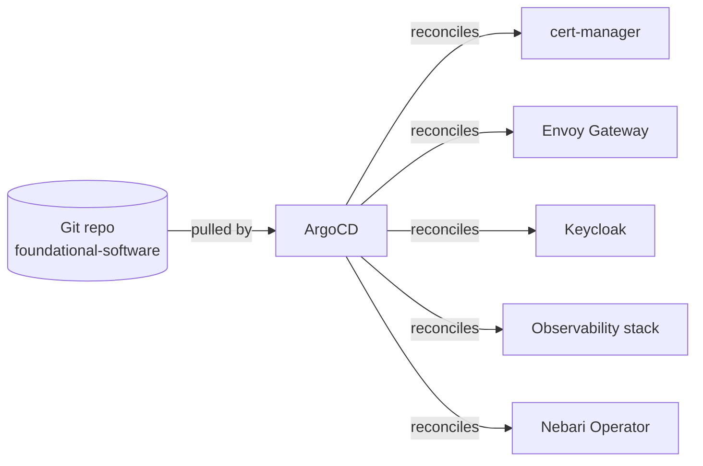

# NKP architecture

Nebari Kubernetes Platform (NKP) lets developers package AI capabilities without handling auth, routing, or TLS themselves. Users then access those capabilities through one secure platform.

## The layers, top to bottom

NKP is a stack of layers, each doing one job. Because the layers connect through stable, well-defined interfaces, you can change one layer without rewriting the others.

{/* Diagram source: docs/static/img/explanations/_sources/nkp-architecture.html
    (open in a browser to view, or import the JSX into Paper / any React renderer to edit) */}


**What users and developers see and control**

- **Dynamic landing page**: the home page where users access the Capabilities installed on the platform.
- **Software Pack**: an installable Capability (chat assistant, document analyzer, code review tool, and so on) packaged by a developer.

**Platform-managed, hidden from users**

- **Nebari Operator**: the automation that deploys each Software Pack and connects it to the Foundational software.
- **Foundational software**: shared services (secure connections, login, traffic routing, monitoring, continuous delivery from Git) that power the operator and every running pack.

**Where it all runs**

- **Managed Kubernetes cluster**: hosts every container above. EKS, GKE, AKS, or K3s for local development.
- **Cloud or bare-metal provider**: the physical infrastructure underneath. AWS, GCP, Azure, dedicated servers (Hetzner, Equinix Metal), or your own machine for development.

<details>
<summary>**What's in the foundational layer**</summary>

- **cert-manager**: keeps secure connections working. Automatically requests, renews, and rotates HTTPS certificates for every domain in the cluster.
- **Envoy Gateway**: handles traffic routing. Inspects incoming requests and forwards each one to the right service, with built-in rate limiting and authentication checks.
- **Keycloak**: handles login. One sign-on covers every app on the platform (ArgoCD, Grafana, Software Packs), with support for multi-factor authentication and connection to an existing identity provider like Active Directory.
- **ArgoCD**: keeps the cluster in sync with a Git repository. Whenever the platform team commits a change to Git (a new pack, an updated config), ArgoCD applies it to the cluster automatically.
- **LGTM telemetry stack**: collects logs, metrics, and traces from every running pack and presents them in shared dashboards.

</details>

## The `nic` CLI

The `nic` CLI (short for **Nebari Infrastructure Core**) is the command-line tool for managing NKP: installing, updating, tearing down, plus inspecting the cloud resources underneath.

### What `nic` does

- **Creates the cloud infrastructure.** This includes the network, the managed Kubernetes cluster and its worker machines, the identity and access controls, and the persistent storage. Under the hood, `nic` uses Terraform to do this.
- **Prepares the cluster.** Sets up the basic Kubernetes structures the platform relies on: organizational groupings (namespaces), permission rules (RBAC), storage templates (storage classes), and network rules (network policies).
- **Installs ArgoCD.** ArgoCD is the GitOps engine that delivers everything above the cluster (the foundational software, the operator, and the packs). `nic` installs it directly so the rest of the platform can flow in from a Git repository.

### What `nic` does not do

- **`nic` is not an application manager.** It does not install or upgrade Software Packs, the Nebari Operator, or any of the foundational software beyond ArgoCD. Those are all delivered from Git through ArgoCD.
- **`nic` does not change the cluster directly after install.** Anything that needs to happen inside a running cluster (a new pack, an updated config) goes through Git first, and ArgoCD applies it.

This split keeps cluster work (the bottom of the stack) and pack work (the top) from blocking each other. Updating the cluster's underlying machines doesn't affect the running packs, and rolling out a new pack version doesn't require a `nic` deploy.

{/* Diagram source: docs/static/img/explanations/_sources/nkp-architecture-split.html
    (open in a browser to view, or import the HTML into Paper via the write_html MCP tool) */}


## GitOps via ArgoCD

ArgoCD is an open-source deployment tool for Kubernetes. It turns every cluster change into a Git commit, so updates land safely, rollbacks take seconds, and the cluster stays in sync without manual intervention.

ArgoCD uses the **app-of-apps** pattern: a top-level Application resource points to a folder of child Applications, each one a piece of foundational software with explicit dependencies.



Three properties follow from this:

- **Single source of truth.** What is in Git is what is in the cluster. There is no "live but undocumented" configuration drift on the application side.
- **Self-healing.** If an operator deletes a resource by hand, ArgoCD puts it back on the next reconciliation tick.
- **Auditable change.** Every platform change is a Git commit; rollbacks are a Git revert.

Software Packs plug into this model from above. A pack ships its workload manifests plus a `NebariApplication` custom resource that declares what the pack needs (domain, paths, auth scope, dashboards). Once that custom resource lands in the cluster, the Nebari Operator picks it up and runs the four reconciliation steps described in the layers section.

## Terraform state and drift detection

`nic` keeps a record of everything it has built in a file called the **Terraform state file**. The file lives in shared cloud storage (S3, Cloud Storage, or Blob Storage) that matches your provider:

| Provider | Backend |
| --- | --- |
| AWS | S3 |
| GCP | Cloud Storage |
| Azure | Blob Storage |
| Local (dev only) | Local file |

This shared record gives `nic` two abilities:

- **Locking:** If two engineers run `nic deploy` at the same time, the second one waits until the first one finishes, so they can't make conflicting changes.

  ```mermaid
  sequenceDiagram
      participant E1 as Engineer 1
      participant SF as State file
      participant E2 as Engineer 2
      E1->>SF: nic deploy (acquires lock)
      Note over E1,SF: Lock held by Engineer 1
      E2->>SF: nic deploy (lock busy, waits)
      E1->>SF: changes applied, releases lock
      SF-->>E2: lock available
      E2->>SF: acquires lock, applies changes
  ```

- **Drift detection:** When someone makes a manual change in the cloud (resizing a node group in the console, editing an IAM policy by hand), the next `nic deploy` spots the difference and proposes a correction to bring things back in line.

  ```mermaid
  flowchart LR
      SF[State file<br/>what nic thinks exists] --> Compare{Compare}
      Cloud[Live cloud<br/>what actually exists] --> Compare
      Compare -- match --> OK[Nothing to do]
      Compare -- differ --> Drift[Drift detected<br/>nic proposes corrections]
  ```

## Separation of concerns

NKP is built around three roles with non-overlapping lifecycles:

| Role | What they own | Tools they use |
| --- | --- | --- |
| **Platform team** | Cluster, foundational software, identity, telemetry | `nic` CLI, Terraform state, ArgoCD admin |
| **Pack developer** | A Software Pack (Helm chart, manifests, `NebariApplication`) | Pack template, Git, the central registry |
| **End user** | Capabilities exposed in the landing page | Browser, Keycloak login |

The boundary is enforced by the architecture, not by convention:

- A pack developer never needs cluster admin or Terraform credentials. They publish a pack to the registry; the operator and ArgoCD do the rest.
- A platform team upgrade (rotating cert-manager, resizing nodes, swapping the ingress controller) does not require coordination with pack developers.
- An end user never sees Kubernetes. They see a Capability on the landing page and click into it.

This is the "why" behind the layering: each role can move at its own cadence without breaking the others.

## Where to go next

- [Get started with NKP](/docs/nkp/get-started): install the platform and run your first cluster.
- [Browse Software Packs](/docs/software-packs/): see what Capabilities are available out of the box.
