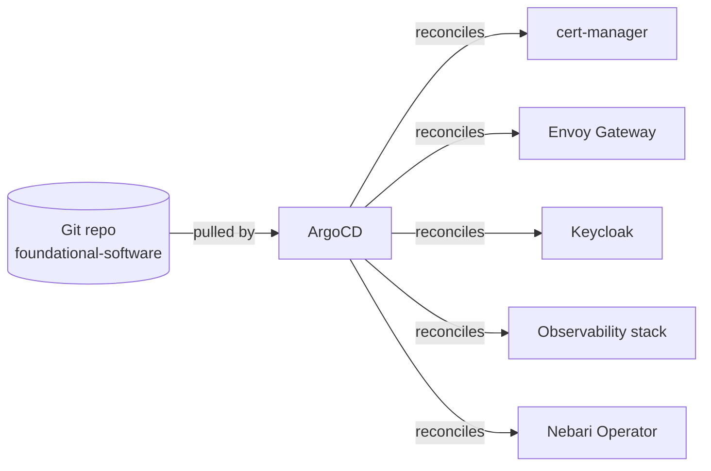

# NKP architecture

Nebari Kubernetes Platform (NKP) is the first **Deploy Target** in the Nebari
ecosystem: the infrastructure that hosts a Nebari platform and runs the
[Software Packs](/docs/introduction#software-packs) installed on it. This page
explains how NKP is put together and why, so you can reason about deployments,
upgrades, and extension points without reading the source.

## The layers, top to bottom

NKP is a stack of layers, each doing one job. Because the layers connect
through stable, well-defined interfaces, you can change one layer without
rewriting the others.

{/* Diagram source: docs/static/img/explanations/_sources/nkp-architecture.html
    (open in a browser to view, or import the JSX into Paper / any React renderer to edit) */}


**What users and developers see and control**

- **Dynamic landing page**: the home page where users browse and open
  installed Capabilities.
- **Software Pack**: an installable Capability (chat assistant, document
  analyzer, code review tool, and so on) built by a developer.

**Platform-managed, hidden from users**

- **Nebari Operator**: the automation that deploys each Software Pack and
  connects it to the Foundational software.
- **Foundational software**: shared services (TLS, login, traffic routing,
  monitoring) plus continuous delivery from Git, all powering the operator
  and every running pack.

**Where it all runs**

- **Managed Kubernetes cluster**: hosts every container above. EKS, GKE, AKS,
  or K3s for local development.
- **Cloud or bare-metal provider**: the physical infrastructure underneath.
  AWS, GCP, Azure, dedicated servers (Hetzner, Equinix Metal), or your own
  machine for development.

### What's in the foundational layer

- **cert-manager**: TLS automation. Let's Encrypt with cloud DNS solvers,
  automatic renewal, wildcards.
- **Envoy Gateway**: routing on the Kubernetes Gateway API. Header- and
  weight-based routing, rate limiting, JWT validation.
- **Keycloak**: OIDC provider with user federation, MFA, and SSO across
  ArgoCD, Grafana, and Software Packs.
- **ArgoCD**: GitOps reconciliation (more on this below).
- **LGTM telemetry stack**: OpenTelemetry Collector, Loki for logs, Grafana
  for visualization, Tempo for traces, Mimir for metrics. Backed by cloud
  object storage for long-term retention.

### How the Operator reconciles a pack

On every reconcile of a `NebariApplication` (`nebari.dev/v1alpha1`), the
controller-runtime operator walks four steps in order:

1. **Routing**: a cert-manager `Certificate` (if TLS is enabled) and an Envoy
   `HTTPRoute` for the application's domain and paths.
2. **Authentication**: a Keycloak OAuth2 client scoped to the application's
   allowed groups, users, and public paths; the client secret lands in a
   Kubernetes `Secret`.
3. **Observability**: a `ServiceMonitor` for metrics and any Grafana
   dashboards declared by the pack (sourced from a URL or a ConfigMap).
4. **Status**: phase moves through `Pending` → `Provisioning` → `Ready`, and
   the public URL plus per-step conditions are written back to the CRD.

## The `nic` CLI

NKP is provisioned by **NIC** (Nebari Infrastructure Core) and its `nic` CLI.
Understanding the boundary of what `nic` owns is the single most important
mental model on this page.

### What `nic` does

- **Provisions the cloud substrate.** `nic` invokes OpenTofu (Terraform)
  modules to create the VPC, the managed Kubernetes cluster, node pools, IAM,
  and durable storage on the chosen provider.
- **Bootstraps the cluster.** It applies namespaces, RBAC, storage classes, and
  network policies needed before higher layers can run.
- **Installs ArgoCD.** This is the only Helm chart `nic` installs directly.
  Everything above ArgoCD is reconciled by ArgoCD itself, not by `nic`.

That is the boundary. After `nic deploy` finishes, the cluster has Kubernetes,
the bootstrap resources, and ArgoCD pointed at a Git repository.

### What `nic` does not do

- **`nic` is not an application manager.** It does not install or upgrade
  Software Packs, the Nebari Operator, or any of the foundational software
  beyond ArgoCD. Those are GitOps concerns (see below).
- **`nic` does not push to the cluster imperatively.** Once ArgoCD is running,
  changes flow from Git into the cluster, not from a developer's laptop.

This separation lets infrastructure and applications evolve on independent
lifecycles: re-rolling a node pool does not touch application state, and
shipping a new pack version does not require a `nic` run.

## GitOps via ArgoCD

Above the cluster, NKP is **declarative and pull-based**. ArgoCD watches a
Git repository (`nebari-foundational-software`) and continuously reconciles
the live cluster state to match it.

ArgoCD uses the **app-of-apps** pattern: a top-level Application resource
points to a folder of child Applications, each one a piece of foundational
software with explicit dependencies.



Three properties follow from this:

- **Single source of truth.** What is in Git is what is in the cluster. There
  is no "live but undocumented" configuration drift on the application side.
- **Self-healing.** If an operator deletes a resource by hand, ArgoCD puts it
  back on the next reconciliation tick.
- **Auditable change.** Every platform change is a Git commit; rollbacks are a
  Git revert.

Software Packs plug into this model from above. A pack ships its workload
manifests plus a `NebariApplication` custom resource that declares what the
pack needs (domain, paths, auth scope, dashboards). Once that custom resource
lands in the cluster, the Nebari Operator picks it up and runs the four
reconciliation steps described in the layers section.

## Terraform state and drift detection

`nic` uses a standard **Terraform state file** to track everything it
provisioned. State is persisted in a remote backend matched to the provider:

| Provider | Backend | Locking |
| --- | --- | --- |
| AWS | S3 | DynamoDB table |
| GCP | Cloud Storage | Object generation metadata |
| Azure | Blob Storage | Blob lease |
| Local (dev only) | Local file | File lock |

Two operational properties matter here:

- **Locking prevents concurrent writes.** Two engineers cannot accidentally
  apply conflicting changes at the same time; the second `nic deploy` blocks
  until the first releases the lock.
- **Drift detection is just `terraform plan`.** Running `nic deploy` against
  an unchanged config produces a diff between the state file and the live
  cloud, surfacing any out-of-band changes (a node group resized in the
  console, an IAM policy edited by hand) as proposed corrections.

State operations are exposed as first-class CLI verbs:

```bash
nic state list                       # list resources tracked in state
nic state show aws_eks_cluster.main  # inspect one resource
nic state rm <addr>                  # forget a resource (does not destroy it)
nic state mv <from> <to>             # rename a resource address
```

### How this differs from Nebari Classic

Classic also used Terraform, but the platform layer above the cluster was
installed imperatively at deploy time and configured per-environment. NKP
splits that responsibility: `nic`'s state covers infrastructure only, while
the platform layer is reconciled by ArgoCD from a Git repository. As a
result:

- **Infrastructure drift** is detectable via `nic deploy` (Terraform plan).
- **Application drift** is detectable via the ArgoCD UI / CLI (sync status).
- The two surfaces never overlap, so a Terraform run cannot break an
  application and a pack upgrade cannot rotate a VPC.

## Separation of concerns

NKP is built around three roles with non-overlapping lifecycles:

| Role | What they own | Tools they use |
| --- | --- | --- |
| **Platform team** | Cluster, foundational software, identity, telemetry | `nic` CLI, Terraform state, ArgoCD admin |
| **Pack developer** | A Software Pack (Helm chart, manifests, `NebariApplication`) | Pack template, Git, the central registry |
| **End user** | Capabilities exposed in the landing page | Browser, Keycloak login |

The boundary is enforced by the architecture, not by convention:

- A pack developer never needs cluster admin or Terraform credentials. They
  publish a pack to the registry; the operator and ArgoCD do the rest.
- A platform team upgrade (rotating cert-manager, resizing nodes, swapping
  the ingress controller) does not require coordination with pack developers.
- An end user never sees Kubernetes. They see a Capability on the landing
  page and click into it.

This is the "why" behind the layering: each role can move at its own cadence
without breaking the others.

## Where to go next

- [Get started with NKP](/docs/nkp/get-started): install the platform and
  run your first cluster.
- [Browse Software Packs](/docs/software-packs/): see what Capabilities are
  available out of the box.
