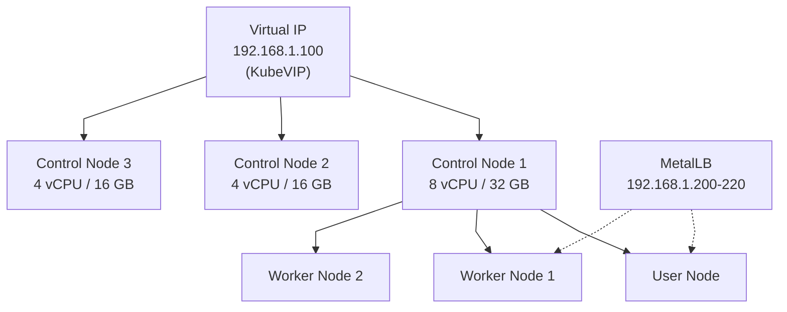

import Tabs from '@theme/Tabs';
import TabItem from '@theme/TabItem';

# Deploy Nebari on Bare Metal with K3s

This how-to guide covers deploying Nebari on bare metal infrastructure using K3s (a lightweight Kubernetes distribution). Choose the approach that best fits your needs:

<div className="deployment-options" style={{display: 'grid', gridTemplateColumns: '1fr 1fr', gap: '20px', marginTop: '20px', marginBottom: '30px'}}>
  <div style={{border: '2px solid var(--ifm-color-primary)', borderRadius: '8px', padding: '20px'}}>
    <h3>🚀 Quick Start</h3>
    <p><strong>Best for:</strong> Testing, development, learning</p>
    <p><strong>Time:</strong> 15-30 minutes</p>
    <p><strong>Servers:</strong> 1 node</p>
    <a href="#quick-start-single-node">Get Started →</a>
  </div>
  <div style={{border: '2px solid var(--ifm-color-success)', borderRadius: '8px', padding: '20px'}}>
    <h3>🏭 Production Setup</h3>
    <p><strong>Best for:</strong> Production workloads, HA deployments</p>
    <p><strong>Time:</strong> 2-3 hours</p>
    <p><strong>Servers:</strong> 3+ nodes</p>
    <a href="#production-deployment">Get Started →</a>
  </div>
</div>

:::info About This Guide
This replaces the deprecated `nebari-slurm` project, providing a modern Kubernetes-based approach for bare metal deployments. For cloud deployments, see [Deploy on Existing Kubernetes](/docs/how-tos/nebari-kubernetes).
:::

---

## Quick Start: Single-Node

Get Nebari running quickly on a single machine for testing, development, or small-scale use.

### Prerequisites

<details>
<summary><strong>System Requirements</strong> (click to expand)</summary>

- One bare metal server or VM
- Ubuntu 20.04+ (or compatible Linux distribution)
- 8 vCPU / 32 GB RAM minimum
- 200 GB disk space
- Root or sudo access

</details>

### Steps

1. **Install K3s**:
   ```bash
   curl -sfL https://get.k3s.io | INSTALL_K3S_EXEC="--disable traefik --disable servicelb" sh -
   ```

   :::info Why These Flags?
   - `--disable traefik`: Nebari installs its own ingress controller
   - `--disable servicelb`: MetalLB will provide LoadBalancer services instead
   :::

2. **Verify installation**:
   ```bash
   sudo k3s kubectl get nodes
   ```

   You should see your node in `Ready` state.

3. **Install MetalLB for LoadBalancer support**:

   <Tabs groupId="metallb-install">
   <TabItem value="kubectl" label="Using kubectl" default>

   ```bash
   # Apply MetalLB manifest
   sudo k3s kubectl apply -f https://raw.githubusercontent.com/metallb/metallb/v0.14.8/config/manifests/metallb-native.yaml

   # Wait for MetalLB pods to be ready
   sudo k3s kubectl wait --namespace metallb-system \
     --for=condition=ready pod \
     --selector=app=metallb \
     --timeout=90s
   ```

   </TabItem>
   <TabItem value="helm" label="Using Helm">

   ```bash
   # Add MetalLB Helm repository
   helm repo add metallb https://metallb.github.io/metallb
   helm repo update

   # Install MetalLB
   helm install metallb metallb/metallb --namespace metallb-system --create-namespace
   ```

   </TabItem>
   </Tabs>

4. **Configure MetalLB IP pool**:

   ```bash
   cat <<EOF | sudo k3s kubectl apply -f -
   apiVersion: metallb.io/v1beta1
   kind: IPAddressPool
   metadata:
     name: default-pool
     namespace: metallb-system
   spec:
     addresses:
     - 192.168.1.200-192.168.1.220  # Adjust to your network
   ---
   apiVersion: metallb.io/v1beta1
   kind: L2Advertisement
   metadata:
     name: default
     namespace: metallb-system
   spec:
     ipAddressPools:
       - default-pool
   EOF
   ```

   :::tip Choosing IP Addresses for Single-Node
   For single-node testing/development, you have two options:

   **Option 1: Use the node's own IP** (simplest for testing)
   - If your server is `192.168.1.50`, use range `192.168.1.50-192.168.1.50`
   - MetalLB will assign services to the same IP as your node
   - Good for: Quick testing, local development

   **Option 2: Use a separate IP range** (more production-like)
   - Select IPs in the same subnet: `192.168.1.200-192.168.1.220`
   - IPs must not be assigned to other devices
   - IPs must not be in your DHCP range
   - Good for: Testing ingress routing, simulating production

   **Example:** If your server is `192.168.1.50`, either use:
   - Simple: `192.168.1.50-192.168.1.50` (same as node)
   - Separate: `192.168.1.200-192.168.1.220` (dedicated range)
   :::5. **Export kubeconfig**:

   <Tabs groupId="kubeconfig-method">
   <TabItem value="local" label="Local Deployment" default>

   ```bash
   # Copy kubeconfig to standard location
   mkdir -p ~/.kube
   sudo cat /etc/rancher/k3s/k3s.yaml > ~/.kube/k3s-config
   chmod 600 ~/.kube/k3s-config
   ```

   </TabItem>
   <TabItem value="remote" label="Remote Deployment">

   ```bash
   # Copy and modify kubeconfig for remote access
   sudo cat /etc/rancher/k3s/k3s.yaml > ~/.kube/k3s-config

   # Replace localhost with actual server IP
   sed -i 's/127.0.0.1/<your-server-ip>/g' ~/.kube/k3s-config
   chmod 600 ~/.kube/k3s-config
   ```

   </TabItem>
   </Tabs>

6. **Label the node** (optional but recommended):

   ```bash
   # Get node name and apply labels
   NODE_NAME=$(sudo k3s kubectl get nodes -o jsonpath='{.items[0].metadata.name}')

   sudo k3s kubectl label node $NODE_NAME \
     node-role.nebari.io/group=general \
     node-role.nebari.io/group=user \
     node-role.nebari.io/group=worker
   ```

7. **Initialize Nebari**:

   ```bash
   nebari init existing \
     --project my-nebari \
     --domain nebari.example.com \
     --auth-provider github
   ```

8. **Configure `nebari-config.yaml`**:

   <details>
   <summary>Click to see minimal configuration</summary>

   ```yaml
   provider: existing
   kubeconfig_path: ~/.kube/k3s-config
   kubernetes_context: default

   local:
     kube_context: default
     node_selectors:
       general:
         key: node-role.nebari.io/group
         value: general
       user:
         key: node-role.nebari.io/group
         value: user
       worker:
         key: node-role.nebari.io/group
         value: worker
   ```

   </details>

9. **Deploy Nebari**:

   ```bash
   nebari deploy -c nebari-config.yaml
   ```

### Next Steps

:::tip What's Next?
✅ Update DNS A record to point to your MetalLB IP
✅ Access Nebari at your configured domain
✅ For production workloads, continue to the [Production Deployment](#production-deployment) section
:::

---

## Production Deployment

Deploy a high-availability Nebari cluster on multiple bare metal servers using automated configuration management.

**When to use this**:
- ✅ Production workloads requiring high availability
- ✅ Multiple servers for resource isolation
- ✅ Need for automated cluster management
- ✅ Growing user base requiring scalability

### Architecture Overview

A production deployment uses:

<div style={{display: 'grid', gridTemplateColumns: 'repeat(auto-fit, minmax(200px, 1fr))', gap: '15px', margin: '20px 0'}}>
  <div style={{border: '1px solid var(--ifm-color-emphasis-300)', borderRadius: '5px', padding: '15px', textAlign: 'center'}}>
    <strong>K3s</strong><br/>
    <small>Lightweight Kubernetes</small>
  </div>
  <div style={{border: '1px solid var(--ifm-color-emphasis-300)', borderRadius: '5px', padding: '15px', textAlign: 'center'}}>
    <strong>KubeVIP</strong><br/>
    <small>Virtual IP for HA</small>
  </div>
  <div style={{border: '1px solid var(--ifm-color-emphasis-300)', borderRadius: '5px', padding: '15px', textAlign: 'center'}}>
    <strong>MetalLB</strong><br/>
    <small>LoadBalancer implementation</small>
  </div>
  <div style={{border: '1px solid var(--ifm-color-emphasis-300)', borderRadius: '5px', padding: '15px', textAlign: 'center'}}>
    <strong>Ansible</strong><br/>
    <small>Automation tool</small>
  </div>
</div>

<div style={{textAlign: 'center'}}>



</div>

### Prerequisites

<Tabs groupId="prerequisites">
<TabItem value="infrastructure" label="Infrastructure" default>

**Minimum 3 servers** (recommended 6+ for production):

| Node Type | vCPU | RAM | Disk | Count | Purpose |
|-----------|------|-----|------|-------|----------|
| Control Plane (Primary) | 8 | 32 GB | 500 GB | 1 | K3s control + Nebari general workloads |
| Control Plane (Secondary) | 4 | 16 GB | 200 GB | 2 | K3s control (HA only) |
| Worker | 8+ | 32+ GB | 200+ GB | 3+ | User sessions, Dask workers |

:::important Primary Control Plane Node
One control plane node should have **significantly more resources** (8 vCPU / 32 GB RAM minimum) because it will:
- Run Kubernetes control plane components (API server, scheduler, controller manager)
- Host Nebari's **general workloads** (JupyterHub, monitoring, databases)
- Serve as the primary management node

The other control plane nodes can be smaller (4 vCPU / 16 GB RAM) as they primarily provide high availability for the Kubernetes API.
:::

**Network requirements**:
- All servers on same network subnet
- Static IP addresses for all servers
- One virtual IP address (for Kubernetes API)
- IP range for MetalLB (5-20 addresses)

**Understanding MetalLB IP Ranges**:

MetalLB requires a range of IP addresses to assign to Kubernetes LoadBalancer services (like Nebari's ingress). Your networking setup determines how you configure this:

<Tabs groupId="network-setup">
<TabItem value="simple" label="Simple/Internal Network" default>

**Scenario**: All servers on a single internal network (e.g., `192.168.1.0/24`)

```
Main Router (192.168.1.1)
    │
    ├── K3s Nodes: 192.168.1.101-106
    └── MetalLB Range: 192.168.1.200-220
```

- Use IPs from the same subnet as your nodes
- Ensure IPs are outside DHCP range
- No additional routing needed
- **Example**: `metal_lb_ip_range: 192.168.1.200-192.168.1.220`

</TabItem>
<TabItem value="dedicated" label="Dedicated Network Interface">

**Scenario**: Bare metal servers with multiple network interfaces, using a dedicated network for services

```
Main Network (eth0/ens192)     Service Network (eth1/ens224)
192.168.1.0/24                 10.0.100.0/24
    │                              │
    ├── Node Management IPs        ├── MetalLB Range: 10.0.100.50-70
    └── Kubernetes API VIP         └── Exposed to external network/firewall
```

- Add a second network interface to each node
- Configure MetalLB to use the service network range
- Route this network through your datacenter's edge router/firewall
- Allows separation of cluster traffic from user-facing services
- **Example**: `metal_lb_ip_range: 10.0.100.50-10.0.100.70`

**Why use this?**
- Security: Separate control plane from user-facing services
- Network policies: Apply different firewall rules to service IPs
- Scalability: Easier to route/load-balance across multiple clusters
- Production standard: Matches typical datacenter network design

</TabItem>
<TabItem value="routed" label="Routed Public IPs">

**Scenario**: Bare metal with routed public IPs (colocation, dedicated servers)

```
Internet
    │
Datacenter Router (routes 203.0.113.0/28)
    │
    ├── Node Internal: 192.168.1.101-106
    └── MetalLB Public: 203.0.113.1-14
```

- Use public IPs routed to your server rack
- Coordinate with your datacenter for IP allocation
- Configure proper firewall rules
- **Example**: `metal_lb_ip_range: 203.0.113.1-203.0.113.14`

</TabItem>
</Tabs>

:::info Choosing the Right Approach
- **Testing/Development**: Use simple internal network (Option 1)
- **Production on-premises**: Use dedicated network interface (Option 2)
- **Colocation/Dedicated servers**: Use routed public IPs (Option 3)
:::

</TabItem>
<TabItem value="control-machine" label="Control Machine">

**Where you run Ansible**:
- Linux/Unix environment (use WSL2 on Windows)
- Python 3.8+
- Ansible 2.10+
- kubectl
- SSH key access to all servers

**Install requirements**:
```bash
# Ubuntu/Debian
sudo apt install python3-pip kubectl
pip3 install ansible

# macOS
brew install ansible kubectl
```

</TabItem>
<TabItem value="servers" label="Server Requirements">

**On all cluster servers**:
- Ubuntu 20.04+ or compatible OS
- Passwordless sudo for SSH user
- Open ports: 6443, 10250, 2379-2380

**Setup SSH access**:
```bash
# Generate SSH key if needed
ssh-keygen -t ed25519 -C "nebari-cluster"

# Copy to all servers
ssh-copy-id ubuntu@192.168.1.101
ssh-copy-id ubuntu@192.168.1.102
# ... repeat for all nodes
```

</TabItem>
</Tabs>

### Step 1: Clone nebari-k3s

```bash
git clone https://github.com/nebari-dev/nebari-k3s.git
cd nebari-k3s
```

### Step 2: Create Inventory

<Tabs groupId="inventory-type">
<TabItem value="simple" label="Simple Inventory" default>

Create `inventory.yml` with your server details:

```yaml
all:
  vars:
    ansible_user: ubuntu
    ansible_ssh_private_key_file: ~/.ssh/id_rsa

  children:
    master:
      hosts:
        node1:
          ansible_host: 192.168.1.101
        node2:
          ansible_host: 192.168.1.102
        node3:
          ansible_host: 192.168.1.103

    node:
      hosts:
        node4:
          ansible_host: 192.168.1.104
        node5:
          ansible_host: 192.168.1.105
        node6:
          ansible_host: 192.168.1.106

    k3s_cluster:
      children:
        master:
        node:
```

</TabItem>
<TabItem value="advanced" label="With Host Variables">

For servers with different configurations:

```yaml
all:
  vars:
    ansible_user: ubuntu
    ansible_ssh_private_key_file: ~/.ssh/id_rsa

  children:
    master:
      hosts:
        node1:
          ansible_host: 192.168.1.101
          flannel_iface: ens192
        node2:
          ansible_host: 192.168.1.102
          flannel_iface: ens192
        node3:
          ansible_host: 192.168.1.103
          flannel_iface: ens160  # Different interface

    node:
      hosts:
        node4:
          ansible_host: 192.168.1.104
          node_labels:
            - "workload=user"
        node5:
          ansible_host: 192.168.1.105
          node_labels:
            - "workload=dask"

    k3s_cluster:
      children:
        master:
        node:
```

</TabItem>
</Tabs>

### Step 3: Configure Variables

<Tabs groupId="config-complexity">
<TabItem value="basic" label="Basic Configuration" default>

Create `group_vars/all.yaml` with minimal required configuration:

```yaml
---
# K3s version
k3s_version: v1.30.2+k3s2

# SSH user
ansible_user: ubuntu

# Network interface (find with: ip addr show)
flannel_iface: ens192

# KubeVIP Configuration
kube_vip_interface: ens192
apiserver_endpoint: 192.168.1.100  # Virtual IP

# Cluster token (generate with: openssl rand -hex 20)
k3s_token: your-secure-cluster-token

# MetalLB IP range
metal_lb_ip_range: 192.168.1.200-192.168.1.220
```

</TabItem>
<TabItem value="advanced" label="Advanced Configuration">

Create `group_vars/all.yaml` with full options:

```yaml
---
# K3s version
k3s_version: v1.30.2+k3s2

# SSH user with sudo access
ansible_user: ubuntu

# Network interface for pod networking
flannel_iface: ens192

# === KubeVIP Configuration (Control Plane HA) ===
kube_vip_arp: true
kube_vip_interface: ens192
kube_vip_tag_version: v0.8.2
apiserver_endpoint: 192.168.1.100  # Virtual IP for API server

# === Cluster Security ===
# Generate with: openssl rand -hex 20
k3s_token: your-secure-cluster-token

# === K3s Arguments ===
extra_server_args: >-
  --tls-san {{ apiserver_endpoint }}
  --disable servicelb
  --disable traefik
  --write-kubeconfig-mode 644
  --flannel-iface={{ flannel_iface }}
  --data-dir /mnt/k3s-data

extra_agent_args: >-
  --flannel-iface={{ flannel_iface }}
  --data-dir /mnt/k3s-data

# === MetalLB Configuration (LoadBalancer) ===
metal_lb_type: native
metal_lb_mode: layer2
metal_lb_speaker_tag_version: v0.14.8
metal_lb_controller_tag_version: v0.14.8
metal_lb_ip_range: 192.168.1.200-192.168.1.220
```

:::info Custom Data Directory
If using `--data-dir /mnt/k3s-data`, ensure this directory exists and is properly mounted on all nodes. See [Advanced Topics](#custom-data-directory) for storage setup.
:::

</TabItem>
</Tabs>

<details>
<summary><strong>💡 Network Interface Reference</strong></summary>

Common interface names by platform:
- **VMware**: `ens192`, `ens160`
- **AWS/Basic**: `eth0`, `eth1`
- **Dell/HP servers**: `eno1`, `eno2`

**Find your interface:**
```bash
ip addr show
```

</details>

### Step 4: Deploy K3s Cluster

:::info Deployment Time
⏱️ 10-20 minutes depending on network speed and number of nodes
:::

Run the Ansible playbook:

```bash
ansible-playbook -i inventory.yml playbook.yaml
```

<details>
<summary><strong>What gets installed?</strong></summary>

✅ K3s on all nodes (control plane + workers)<br/>
✅ KubeVIP for control plane HA<br/>
✅ MetalLB for LoadBalancer services<br/>
✅ Proper node labels and configurations<br/>

</details>

### Step 5: Sync Kubeconfig

Copy kubeconfig from cluster to your local machine:

```bash
export SSH_USER="root"
export SSH_HOST="192.168.1.101"  # Any control plane node
export SSH_KEY_FILE="~/.ssh/id_rsa"

make kubeconfig-sync
```

Verify cluster access:

```bash
kubectl get nodes -o wide
```

### Step 6: Label Nodes

Label nodes for Nebari workload scheduling:

```bash
# Control plane nodes (general workloads)
kubectl label nodes node1 node2 node3 \
  node-role.nebari.io/group=general

# User workload nodes
kubectl label nodes node4 \
  node-role.nebari.io/group=user

# Dask worker nodes
kubectl label nodes node5 node6 \
  node-role.nebari.io/group=worker
```

Verify labels:

```bash
kubectl get nodes --show-labels
```

### Step 7: Initialize Nebari

```bash
nebari init existing \
  --project my-nebari \
  --domain nebari.example.com \
  --auth-provider github
```

### Step 8: Configure Nebari

Edit `nebari-config.yaml`:

```yaml
project_name: my-nebari
provider: existing
domain: nebari.example.com

certificate:
  type: lets-encrypt
  acme_email: admin@example.com

security:
  authentication:
    type: GitHub
    config:
      client_id: <your-github-oauth-client-id>
      client_secret: <your-github-oauth-client-secret>

local:
  kube_context: default
  node_selectors:
    general:
      key: node-role.nebari.io/group
      value: general
    user:
      key: node-role.nebari.io/group
      value: user
    worker:
      key: node-role.nebari.io/group
      value: worker

profiles:
  jupyterlab:
    - display_name: Small Instance
      description: 2 CPU / 8 GB RAM
      default: true
      kubespawner_override:
        cpu_limit: 2
        cpu_guarantee: 1.5
        mem_limit: 8G
        mem_guarantee: 5G

    - display_name: Medium Instance
      description: 4 CPU / 16 GB RAM
      kubespawner_override:
        cpu_limit: 4
        cpu_guarantee: 3
        mem_limit: 16G
        mem_guarantee: 10G

  dask_worker:
    Small Worker:
      worker_cores_limit: 2
      worker_cores: 1.5
      worker_memory_limit: 8G
      worker_memory: 5G
    Medium Worker:
      worker_cores_limit: 4
      worker_cores: 3
      worker_memory_limit: 16G
      worker_memory: 10G
```

### Step 9: Deploy Nebari

```bash
nebari deploy -c nebari-config.yaml
```

### Step 10: Verify Deployment

<Tabs groupId="verify-method">
<TabItem value="quick" label="Quick Check" default>

```bash
# Check if all pods are running
kubectl get pods -A
```

All pods should be in `Running` or `Completed` state.

</TabItem>
<TabItem value="detailed" label="Detailed Verification">

```bash
# 1. Check all pods
kubectl get pods -A

# 2. Check ingress services
kubectl get ingress -A

# 3. Verify LoadBalancer IPs assigned
kubectl get svc -A | grep LoadBalancer

# 4. Check Nebari namespaces
kubectl get pods -n nebari
kubectl get pods -n jhub
```

</TabItem>
<TabItem value="troubleshoot" label="Troubleshooting">

```bash
# Check pod status with details
kubectl get pods -A -o wide

# Check events for errors
kubectl get events -A --sort-by='.lastTimestamp'

# Check specific pod logs
kubectl logs <pod-name> -n <namespace>

# Describe problematic pods
kubectl describe pod <pod-name> -n <namespace>
```

</TabItem>
</Tabs>

:::tip 🎉 Final Step
Update your DNS A record to point to one of the MetalLB IP addresses, then access Nebari at your configured domain.
:::

---

## Reference

### Configuration Variables

<div style={{overflowX: 'auto'}}>

| Variable | Required | Default | Description |
|----------|----------|---------|-------------|
| `k3s_version` | ✅ Yes | - | K3s version (e.g., v1.30.2+k3s2) |
| `ansible_user` | ✅ Yes | - | SSH user with passwordless sudo |
| `flannel_iface` | ✅ Yes | - | Network interface for pod networking |
| `kube_vip_interface` | ✅ Yes | - | Network interface for virtual IP |
| `kube_vip_tag_version` | ❌ No | v0.8.2 | KubeVIP container version |
| `apiserver_endpoint` | ✅ Yes | - | Virtual IP for Kubernetes API |
| `k3s_token` | ✅ Yes | - | Cluster auth token (alphanumeric) |
| `metal_lb_ip_range` | ✅ Yes | - | IP range for LoadBalancer services |
| `metal_lb_type` | ❌ No | native | MetalLB type (native/frr) |
| `metal_lb_mode` | ❌ No | layer2 | MetalLB mode (layer2/bgp) |

</div>

### Node Selector Labels

<div style={{display: 'grid', gridTemplateColumns: 'repeat(auto-fit, minmax(280px, 1fr))', gap: '15px', margin: '20px 0'}}>
  <div style={{border: '2px solid var(--ifm-color-primary)', borderRadius: '8px', padding: '15px'}}>
    <strong>📊 general</strong><br/>
    <small>Purpose:</small> Core services (JupyterHub, monitoring)<br/>
    <small>Typical nodes:</small> Control plane nodes<br/>
    <code>node-role.nebari.io/group=general</code>
  </div>
  <div style={{border: '2px solid var(--ifm-color-success)', borderRadius: '8px', padding: '15px'}}>
    <strong>👥 user</strong><br/>
    <small>Purpose:</small> User JupyterLab sessions<br/>
    <small>Typical nodes:</small> Dedicated user nodes<br/>
    <code>node-role.nebari.io/group=user</code>
  </div>
  <div style={{border: '2px solid var(--ifm-color-warning)', borderRadius: '8px', padding: '15px'}}>
    <strong>⚙️ worker</strong><br/>
    <small>Purpose:</small> Dask workers, batch jobs<br/>
    <small>Typical nodes:</small> High-resource worker nodes<br/>
    <code>node-role.nebari.io/group=worker</code>
  </div>
</div>

---

## Troubleshooting

### Pods Not Scheduling

:::caution Symptom
🚨 Pods remain in `Pending` state
:::

**Quick diagnosis:**
```bash
kubectl describe pod <pod-name> -n <namespace>
```

<details>
<summary><strong>Common Causes & Solutions</strong></summary>

**1. Node labels don't match selectors**
```bash
# Check actual labels
kubectl get nodes --show-labels

# Compare with nebari-config.yaml node_selectors
# Fix: Apply correct labels
kubectl label node <node-name> node-role.nebari.io/group=<value>
```

**2. Insufficient resources**
```bash
# Check node resources
kubectl describe nodes
kubectl top nodes  # Requires metrics-server

# Fix: Add more nodes or adjust resource requests
```

**3. Node taints**
```bash
# Check for taints
kubectl get nodes -o json | jq '.items[].spec.taints'

# Fix: Remove unwanted taints
kubectl taint nodes <node-name> <taint-key>-
```

</details>

---

### LoadBalancer Service Pending

:::caution Symptom
🚨 Service stuck in `Pending` with no external IP
:::

**Quick diagnosis:**
```bash
kubectl get svc -A | grep LoadBalancer
kubectl get pods -n metallb-system
```

<details>
<summary><strong>MetalLB Troubleshooting Steps</strong></summary>

**1. Verify MetalLB is running**
```bash
# Check MetalLB pods
kubectl get pods -n metallb-system

# All pods should be Running
```

**2. Check MetalLB configuration**
```bash
# Verify IP pool
kubectl get ipaddresspool -n metallb-system -o yaml

# Verify L2 advertisement
kubectl get l2advertisement -n metallb-system -o yaml
```

**3. Check for IP conflicts**
```bash
# Ping IPs in your range to check if already in use
ping 192.168.1.200

# Check MetalLB logs
kubectl logs -n metallb-system -l app=metallb --tail=50
```

**4. Common fixes**
- Ensure IP range doesn't overlap with DHCP
- Verify IPs are in same subnet as nodes
- Check firewall rules allow ARP traffic

</details>

---

### API Server Unreachable

:::caution Symptom
🚨 Cannot connect to cluster with kubectl
:::

**Quick diagnosis:**
```bash
# Test virtual IP connectivity
ping <apiserver_endpoint>

# Test API server port
telnet <apiserver_endpoint> 6443
```

<details>
<summary><strong>KubeVIP Troubleshooting Steps</strong></summary>

**1. Check KubeVIP status**
```bash
# SSH to a control plane node
ssh ubuntu@<control-plane-ip>

# Check KubeVIP pods
sudo k3s kubectl get pods -n kube-system | grep kube-vip

# Check KubeVIP logs
sudo k3s kubectl logs -n kube-system <kube-vip-pod>
```

**2. Verify network configuration**
```bash
# Check if virtual IP is assigned
ip addr show | grep <apiserver_endpoint>

# Verify correct interface
ip addr show <kube_vip_interface>
```

**3. Common fixes**
- Verify `kube_vip_interface` matches actual network interface
- Ensure virtual IP is in same subnet as nodes
- Check firewall allows traffic on port 6443
- Verify ARP is enabled (`kube_vip_arp: true`)

</details>

---

## Advanced Topics

### Custom Data Directory

For production with dedicated storage volumes, configure K3s to use custom data directories.

**Why**: Separate OS and application data, use high-performance storage, better disk management.

Add to `group_vars/all.yaml`:
```yaml
extra_server_args: >-
  --data-dir /mnt/k3s-data
  [... other args ...]

extra_agent_args: >-
  --data-dir /mnt/k3s-data
```

**Prepare storage on each node**:

```bash
# For standard disk
sudo mkfs.ext4 /dev/sdb
sudo mkdir -p /mnt/k3s-data
echo '/dev/sdb /mnt/k3s-data ext4 defaults 0 0' | sudo tee -a /etc/fstab
sudo mount -a

# For LVM with XFS (better for large files)
sudo lvcreate -L 1400G -n k3s-data ubuntu-vg
sudo mkfs.xfs /dev/ubuntu-vg/k3s-data
UUID=$(sudo blkid -s UUID -o value /dev/ubuntu-vg/k3s-data)
echo "UUID=$UUID /mnt/k3s-data xfs defaults 0 2" | sudo tee -a /etc/fstab
sudo mount -a
```

### Storage Configuration

K3s includes a `local-path` storage provisioner suitable for development. For production:

**Options**:
- **Local storage**: Use K3s default `local-path` storage class
- **NFS**: Configure NFS server and use NFS storage class
- **Ceph/Rook**: Distributed storage for multi-node persistent volumes
- **Cloud CSI**: If hybrid cloud, use provider-specific CSI drivers

**Example NFS configuration**:
```yaml
# In nebari-config.yaml
default_storage_class: nfs-client
```

### Migrating User Data

When migrating from existing systems:

1. **Copy data to storage node**:
   ```bash
   rsync -avhP -e ssh /old/home/ user@k3s-node:/mnt/k3s-data/backup/home/
   ```

2. **Check JupyterHub UIDs**:
   ```bash
   kubectl exec -it jupyter-<username> -- id
   ```

3. **Adjust ownership if needed**:
   ```bash
   sudo chown -R <jupyter-uid>:<jupyter-gid> /mnt/k3s-data/backup/home/<username>
   ```

### Scaling the Cluster

**Add worker nodes**:
1. Add nodes to `inventory.yml`
2. Run playbook targeting new nodes:
   ```bash
   ansible-playbook -i inventory.yml playbook.yaml --limit new-node
   ```
3. Label new nodes for Nebari

**Upgrade K3s**:
1. Update `k3s_version` in `group_vars/all.yaml`
2. Run playbook:
   ```bash
   ansible-playbook -i inventory.yml playbook.yaml
   ```

:::warning
Always test upgrades in non-production first. Backup data before upgrading.
:::

---

## Next Steps

<div style={{display: 'grid', gridTemplateColumns: 'repeat(auto-fit, minmax(200px, 1fr))', gap: '15px', margin: '20px 0'}}>
  <div style={{border: '1px solid var(--ifm-color-emphasis-300)', borderRadius: '8px', padding: '15px'}}>
    <strong>👨‍💻 Environment Management</strong><br/>
    <small>Configure conda environments and packages</small><br/>
    <a href="/docs/how-tos/nebari-environment-management">→ Learn more</a>
  </div>
  <div style={{border: '1px solid var(--ifm-color-emphasis-300)', borderRadius: '8px', padding: '15px'}}>
    <strong>📊 Monitoring</strong><br/>
    <small>Set up Prometheus and Grafana</small><br/>
    <a href="/docs/how-tos/setup-monitoring">→ Learn more</a>
  </div>
  <div style={{border: '1px solid var(--ifm-color-emphasis-300)', borderRadius: '8px', padding: '15px'}}>
    <strong>💾 Backups</strong><br/>
    <small>Configure backup strategies</small><br/>
    <a href="/docs/how-tos/manual-backup">→ Learn more</a>
  </div>
  <div style={{border: '1px solid var(--ifm-color-emphasis-300)', borderRadius: '8px', padding: '15px'}}>
    <strong>⚡ Distributed Computing</strong><br/>
    <small>Explore Dask for parallel processing</small><br/>
    <a href="/docs/tutorials/using_dask">→ Learn more</a>
  </div>
</div>

## Additional Resources

- [nebari-k3s GitHub Repository](https://github.com/nebari-dev/nebari-k3s)
- [K3s Documentation](https://docs.k3s.io/)
- [KubeVIP Documentation](https://kube-vip.io/)
- [MetalLB Documentation](https://metallb.universe.tf/)
- [Diátaxis Documentation Framework](https://diataxis.fr/)

## Quick Start: Single-Node Setup

If you're just getting started or want to test Nebari on bare metal, you can deploy K3s directly on a single machine. This is perfect for development, testing, or small-scale deployments.

### Install K3s on a Single Node

1. **Prepare your machine** (Ubuntu 20.04+ or similar):
   ```bash
   # Update system packages
   sudo apt update && sudo apt upgrade -y
   ```

2. **Install K3s with the default installer**:
   ```bash
   curl -sfL https://get.k3s.io | sh -
   ```

   This single command downloads and installs K3s, sets it up as a systemd service, and configures everything needed to run Kubernetes.

3. **Verify K3s is running**:
   ```bash
   sudo k3s kubectl get nodes
   ```

   You should see your node in a "Ready" state.

4. **Get your kubeconfig** for Nebari deployment:
   ```bash
   sudo cat /etc/rancher/k3s/k3s.yaml
   ```

   Copy this kubeconfig content. You'll need to:
   - Save it to a file (e.g., `~/.kube/k3s-config`)
   - Replace `127.0.0.1` with your server's actual IP address if deploying from another machine

5. **Configure Nebari to use your K3s cluster**:

   In your `nebari-config.yaml`:
   ```yaml
   provider: existing

   kubeconfig_path: ~/.kube/k3s-config  # Path to the kubeconfig file you saved

   kubernetes_context: default  # The context name from your kubeconfig

   # Optional: Configure node groups
   default_node_groups:
     general:
       instance: general-instance
       min_nodes: 1
       max_nodes: 1
     user:
       instance: user-instance
       min_nodes: 1
       max_nodes: 1
     worker:
       instance: worker-instance
       min_nodes: 1
       max_nodes: 1

   node_selectors:
     general:
       node-role.nebari.io/group: general
     user:
       node-role.nebari.io/group: user
     worker:
       node-role.nebari.io/group: worker
   ```

6. **Label your node** (optional but recommended):
   ```bash
   # Get your node name
   sudo k3s kubectl get nodes

   # Apply labels
   sudo k3s kubectl label node <your-node-name> node-role.nebari.io/group=general
   sudo k3s kubectl label node <your-node-name> node-role.nebari.io/group=user
   sudo k3s kubectl label node <your-node-name> node-role.nebari.io/group=worker
   ```

7. **Install MetalLB for LoadBalancer support**:

   Nebari requires LoadBalancer services for ingress. Install MetalLB to provide this on bare metal:

   ```bash
   # Download and apply MetalLB manifest
   kubectl apply -f https://raw.githubusercontent.com/metallb/metallb/v0.14.8/config/manifests/metallb-native.yaml

   # Wait for MetalLB to be ready
   kubectl wait --namespace metallb-system \
     --for=condition=ready pod \
     --selector=app=metallb \
     --timeout=90s
   ```

   Configure MetalLB with an IP address pool (adjust IP range to match your network):

   ```bash
   cat <<EOF | kubectl apply -f -
   apiVersion: metallb.io/v1beta1
   kind: IPAddressPool
   metadata:
     name: default-pool
     namespace: metallb-system
   spec:
     addresses:
     - 192.168.1.200-192.168.1.220  # Adjust to your available IP range
   ---
   apiVersion: metallb.io/v1beta1
   kind: L2Advertisement
   metadata:
     name: default
     namespace: metallb-system
   spec:
     ipAddressPools:
       - default-pool
   EOF
   ```

   :::tip IP Address Range
   The IP range should be:
   - In the same subnet as your K3s node
   - Not used by DHCP or other devices
   - Accessible from your network
   - Reserve at least 5-10 addresses for Nebari services
   :::

8. **Deploy Nebari**:
   ```bash
   nebari deploy -c nebari-config.yaml
   ```

### When to Move to Production

This single-node setup works great for testing, but for production you'll want:
- **High availability**: Multiple control plane nodes so your cluster survives node failures
- **Better resource isolation**: Separate nodes for different workloads (user sessions, background jobs, system services)
- **Easier management**: Automated provisioning and configuration with Ansible
- **Load balancing**: Proper ingress and service load balancing with MetalLB

That's where the production setup comes in - continue reading to learn how to deploy a production-ready, highly available Nebari cluster.

---

## Production Setup with nebari-k3s

For production deployments, we recommend using [nebari-k3s](https://github.com/nebari-dev/nebari-k3s) - an Ansible-based solution that sets up a production-ready K3s cluster with KubeVIP and MetalLB.

### What You'll Be Using

**[K3s](https://k3s.io/)** - A lightweight, certified Kubernetes distribution designed for resource-constrained environments and edge computing. Unlike full Kubernetes, K3s:
- Uses a single binary of less than 100MB
- Has lower memory and CPU requirements
- Is easier to install and maintain
- Is perfect for bare metal deployments where you want Kubernetes without the complexity

**[Ansible](https://www.ansible.com/)** - An automation tool that uses simple YAML files (playbooks) to configure and manage servers. In this guide, Ansible:
- Installs and configures K3s on all your nodes
- Sets up networking components (KubeVIP, MetalLB)
- Ensures consistent configuration across your cluster
- Runs from your local machine or a control node

**[KubeVIP](https://kube-vip.io/)** - Provides a highly-available virtual IP address for your Kubernetes API server. This means:
- Your cluster remains accessible even if a control plane node fails
- All nodes use a single IP to access the Kubernetes API
- Essential for multi-master (HA) setups

**[MetalLB](https://metallb.universe.tf/)** - A load balancer implementation for bare metal clusters. Since cloud providers automatically provide load balancers but bare metal doesn't, MetalLB:
- Assigns external IP addresses to Kubernetes services
- Enables Nebari's ingress to be accessible from outside the cluster
- Uses Layer 2 (ARP) or BGP to advertise service IPs

### Overview

The `nebari-k3s` project provides Ansible playbooks to:
- Deploy a lightweight K3s Kubernetes cluster on bare metal servers
- Configure KubeVIP for high-availability control plane
- Set up MetalLB for load balancing
- Prepare the cluster for Nebari deployment

This approach is ideal for:
- On-premises deployments
- Organizations with existing bare metal infrastructure
- HPC environments transitioning from traditional batch systems
- Cost-sensitive deployments requiring full hardware control

:::info
This solution replaces the deprecated `nebari-slurm` project, providing a modern Kubernetes-based alternative for bare metal deployments.
:::

## Prerequisites

### Infrastructure Requirements

- **Minimum 3 bare metal servers** (recommended for HA):
  - Control plane nodes: 8 vCPU / 32 GB RAM minimum
  - Worker nodes: 4 vCPU / 16 GB RAM minimum per node
  - 200 GB disk space per node

- **Network requirements**:
  - All nodes on the same subnet
  - Static IP addresses assigned to each node
  - SSH access to all nodes
  - IP range reserved for MetalLB load balancer
  - Virtual IP address for the Kubernetes API server

### Software Requirements

On your local machine (where you'll run Ansible):
- Python 3.8+
- Ansible 2.10+
- kubectl
- SSH key access to all nodes

On bare metal nodes:
- Ubuntu 20.04+ or compatible Linux distribution
- Passwordless sudo access for the SSH user

:::note Running Ansible
Ansible requires a Linux/Unix environment. If your workstation runs Windows:
- Use WSL2 (Windows Subsystem for Linux)
- Deploy from one of your Linux nodes (e.g., the first control plane node)
- Use a Linux VM or container

The deployment examples below assume you're running from a Linux environment with direct SSH access to all cluster nodes.
:::

## Step 1: Clone nebari-k3s Repository

```bash
git clone https://github.com/nebari-dev/nebari-k3s.git
cd nebari-k3s
```

## Step 2: Configure Inventory

Create an Ansible inventory file describing your cluster:

```yaml
# inventory.yml
all:
  vars:
    ansible_user: ubuntu
    ansible_ssh_private_key_file: ~/.ssh/id_rsa

    # K3s configuration
    k3s_version: v1.28.5+k3s1
    apiserver_endpoint: "192.168.1.100"  # Virtual IP for API server

    # KubeVIP configuration
    kube_vip_tag_version: "v0.7.0"
    kube_vip_interface: "ens5"  # Network interface for VIP (default: ens5)
    kube_vip_lb_ip_range: "192.168.1.200-192.168.1.220"  # IPs for services

    # MetalLB configuration
    metal_lb_ip_range:
      - "192.168.1.200-192.168.1.220"

  children:
    master:
      hosts:
        node1:
          ansible_host: 192.168.1.101
        node2:
          ansible_host: 192.168.1.102
        node3:
          ansible_host: 192.168.1.103

    node:
      hosts:
        node4:
          ansible_host: 192.168.1.104
        node5:
          ansible_host: 192.168.1.105
        node6:
          ansible_host: 192.168.1.106

    k3s_cluster:
      children:
        master:
        node:
```

### Advanced Configuration with Custom Data Directory

For production deployments, especially when using dedicated storage volumes, configure K3s to use a custom data directory. This is particularly important when:
- You have multiple disks (OS disk and separate data disk)
- You want to use high-performance storage for Kubernetes data
- You need to manage disk space separately for system and application data

Create or update your `group_vars/all.yaml`:

```yaml
---
# K3s version to install
# Check https://github.com/k3s-io/k3s/releases for available versions
k3s_version: v1.30.2+k3s2

# Ansible connection user (must have passwordless sudo on all nodes)
ansible_user: ubuntu

# Network interface used by flannel CNI for pod networking
# Run 'ip addr show' on your nodes to find the correct interface
flannel_iface: ens192

# ============ KubeVIP Configuration ============
# KubeVIP provides a virtual IP for the Kubernetes API server (HA)

# Enable ARP broadcasts for virtual IP
kube_vip_arp: true

# Network interface where the virtual IP will be configured
# Must match the interface with connectivity to other nodes
kube_vip_interface: ens192

# KubeVIP container image version
kube_vip_tag_version: v0.8.2

# Virtual IP address for Kubernetes API server
# This IP must be:
# - In the same subnet as your nodes
# - Not currently in use by any other device
# - Accessible from all nodes
apiserver_endpoint: 192.168.1.100

# ============ Cluster Security ============
# Shared secret token for K3s cluster nodes to authenticate
# IMPORTANT: Must be alphanumeric only (no special characters)
# Generate a secure random token: openssl rand -hex 20
k3s_token: your-secure-cluster-token

# ============ K3s Server Arguments ============
# Additional arguments passed to K3s server nodes (control plane)
extra_server_args: >-
  --tls-san {{ apiserver_endpoint }}
  --disable servicelb
  --disable traefik
  --write-kubeconfig-mode 644
  --flannel-iface={{ flannel_iface }}
  --data-dir /mnt/k3s-data

# --tls-san: Add virtual IP to API server TLS certificate
# --disable servicelb: Disable built-in load balancer (we use MetalLB)
# --disable traefik: Disable built-in ingress (Nebari installs its own)
# --write-kubeconfig-mode 644: Make kubeconfig readable
# --flannel-iface: Network interface for pod networking
# --data-dir: Custom location for K3s data (optional, see Step 2.1)

# ============ K3s Agent Arguments ============
# Additional arguments passed to K3s agent nodes (workers)
extra_agent_args: >-
  --flannel-iface={{ flannel_iface }}
  --data-dir /mnt/k3s-data

# ============ MetalLB Configuration ============
# MetalLB provides LoadBalancer services on bare metal

# MetalLB type: 'native' (recommended) or 'frr'
metal_lb_type: native

# MetalLB mode: 'layer2' (simple ARP-based) or 'bgp' (requires BGP router)
metal_lb_mode: layer2

# MetalLB speaker image version
metal_lb_speaker_tag_version: v0.14.8

# MetalLB controller image version
metal_lb_controller_tag_version: v0.14.8

# IP address range for LoadBalancer services
# Can be a string or list: "192.168.1.200-192.168.1.220" or ["192.168.1.200-192.168.1.220"]
# These IPs will be assigned to Nebari's ingress and other LoadBalancer services
# Requirements:
# - Must be in the same subnet as your nodes
# - Must not overlap with DHCP ranges or other static IPs
# - Reserve enough IPs for all services (typically 5-10 is sufficient)
metal_lb_ip_range: 192.168.1.200-192.168.1.220  # Can also be a list: ["192.168.1.200-192.168.1.220"]
```

### Variable Reference Summary

| Variable | Required | Default | Description |
|----------|----------|---------|-------------|
| `k3s_version` | Yes | - | K3s version to install |
| `ansible_user` | Yes | - | SSH user with sudo access |
| `flannel_iface` | Yes | - | Network interface for pod networking |
| `kube_vip_interface` | Yes | - | Network interface for virtual IP |
| `kube_vip_tag_version` | No | v0.8.2 | KubeVIP image version |
| `kube_vip_arp` | No | true | Enable ARP for virtual IP |
| `apiserver_endpoint` | Yes | - | Virtual IP for Kubernetes API |
| `k3s_token` | Yes | - | Cluster authentication token (alphanumeric) |
| `extra_server_args` | No | - | Additional K3s server arguments |
| `extra_agent_args` | No | - | Additional K3s agent arguments |
| `metal_lb_type` | No | native | MetalLB implementation type |
| `metal_lb_mode` | No | layer2 | MetalLB operating mode |
| `metal_lb_ip_range` | Yes | - | IP range for LoadBalancer services |
metal_lb_speaker_tag_version: v0.14.8
metal_lb_controller_tag_version: v0.14.8
metal_lb_ip_range: 192.168.1.200-192.168.1.220  # Can also be a list: ["192.168.1.200-192.168.1.220"]
```

:::warning Important: Custom Data Directory
If you specify `--data-dir /mnt/k3s-data`, you **must** ensure this directory exists and is properly mounted on **all** nodes before running the Ansible playbook. See Step 2.1 below.
:::

### Step 2.1: Prepare Storage (Required for Custom Data Directory)

If you're using a custom data directory with dedicated storage volumes, prepare them on each node:

#### For worker nodes with separate data disks:

```bash
# On each node, identify the data disk
lsblk

# Format the disk (example: /dev/sdb - verify your disk name!)
sudo mkfs.ext4 /dev/sdb

# Create mount point
sudo mkdir -p /mnt/k3s-data

# Add to fstab for persistence
echo '/dev/sdb /mnt/k3s-data ext4 defaults 0 0' | sudo tee -a /etc/fstab

# Mount the disk
sudo mount -a

# Verify
df -h /mnt/k3s-data
```

#### For control plane with large storage requirements (using LVM):

If your control plane node needs flexible storage management (e.g., for backups, persistent volumes):

```bash
# Check available volume groups
sudo vgs

# Create logical volume (example: 1.4TB from existing volume group)
sudo lvcreate -L 1400G -n k3s-data ubuntu-vg

# Format with XFS for better performance with large files
sudo mkfs.xfs /dev/ubuntu-vg/k3s-data

# Create mount point
sudo mkdir -p /mnt/k3s-data

# Add to fstab using UUID for reliability
UUID=$(sudo blkid -s UUID -o value /dev/ubuntu-vg/k3s-data)
echo "UUID=$UUID /mnt/k3s-data xfs defaults 0 2" | sudo tee -a /etc/fstab

# Mount
sudo mount -a

# Verify
df -h /mnt/k3s-data
lsblk
```

:::tip Storage Recommendations
- **XFS**: Better for large files and high I/O workloads (recommended for nodes with databases or large datasets)
- **ext4**: General purpose, good default choice for most workloads
- **Leave space for expansion**: Don't allocate 100% of available storage to allow for future growth
- **Consistent paths**: Use the same mount point (`/mnt/k3s-data`) on all nodes
:::

### Step 2.2: Verify Network Interfaces

Ensure you're using the correct network interface names in your configuration:

```bash
# On each node, list network interfaces
ip addr show

# Common interface names:
# - ens192, ens160 (VMware)
# - eth0, eth1 (AWS, some bare metal)
# - eno1, eno2 (Dell, HP servers)
```

Update `flannel_iface` and `kube_vip_interface` in your `group_vars/all.yaml` to match your actual interface names.

## Step 3: Run Ansible Playbook

Deploy the K3s cluster:

```bash
ansible-playbook -i inventory.yml playbook.yaml
```

This will:
1. Install K3s on all nodes
2. Configure the control plane with high availability
3. Deploy KubeVIP for API server load balancing
4. Install and configure MetalLB for service load balancing
5. Set up proper node labels and taints

:::warning Known Issue: Multi-Master Join
There's a known issue in nebari-k3s where additional master nodes may fail to join the cluster correctly due to the IP filtering task returning multiple IPs. If you encounter this:

1. Check that additional master nodes are running K3s:
   ```bash
   ssh user@node2 "sudo systemctl status k3s"
   ```

2. Verify they can reach the first master node:
   ```bash
   ssh user@node2 "curl -k https://192.168.1.101:6443/ping"
   ```

3. If a node is running but not joined, you may need to manually re-run the join command on that node or investigate the Ansible task that filters the flannel interface IP.
:::

## Step 4: Sync Kubeconfig

After the playbook completes, sync the kubeconfig to your local machine:

```bash
# Set environment variables
export SSH_USER="root"  # Default: root (change if using different user)
export SSH_HOST="192.168.1.101"  # IP of any master node
export SSH_KEY_FILE="~/.ssh/id_rsa"

# Sync kubeconfig
make kubeconfig-sync
```

Verify cluster access:

```bash
kubectl get nodes -o wide
```

You should see all your nodes in a `Ready` state.

## Step 5: Label Nodes for Nebari

Nebari requires specific node labels for scheduling workloads. For optimal resource utilization and proper workload distribution, use the recommended `node-role.nebari.io/group` label:

```bash
# Label control plane/general nodes
kubectl label nodes node1 node2 node3 \
  node-role.nebari.io/group=general

# Label user workload nodes
kubectl label nodes node4 \
  node-role.nebari.io/group=user

# Label Dask worker nodes
kubectl label nodes node5 node6 \
  node-role.nebari.io/group=worker
```

:::tip Node Labeling Best Practices
- **Consistent labeling**: Using `node-role.nebari.io/group` as the label key ensures consistent behavior across all Nebari components
- **Multiple roles**: A node can have multiple roles if needed (e.g., both `user` and `worker` on the same node)
- **Control plane nodes**: Typically labeled as `general` to host core Nebari services
- **Resource optimization**: Proper labeling enables Horizontal Pod Autoscaling (HPA) to fully utilize your cluster resources

**Alternative labeling schemes** (legacy):
```bash
# These also work but are less recommended
kubectl label nodes node1 node-role.kubernetes.io/general=true
```
:::

Verify your labels:

```bash
kubectl get nodes --show-labels
```

## Step 6: Initialize Nebari Configuration

Now initialize Nebari for deployment on your existing cluster:

```bash
nebari init existing \
  --project my-nebari \
  --domain nebari.example.com \
  --auth-provider github
```

## Step 7: Configure Nebari for Bare Metal

Edit the generated `nebari-config.yaml` to configure it for your K3s cluster:

```yaml
project_name: my-nebari
provider: existing
domain: nebari.example.com

certificate:
  type: lets-encrypt
  acme_email: admin@example.com
  acme_server: https://acme-v02.api.letsencrypt.org/directory

security:
  authentication:
    type: GitHub
    config:
      client_id: <github-oauth-app-client-id>
      client_secret: <github-oauth-app-client-secret>
      oauth_callback_url: https://nebari.example.com/hub/oauth_callback

local:
  # Specify the kubectl context name from your kubeconfig
  kube_context: "default"  # Or the context name from your K3s cluster

  # Configure node selectors to match your labeled nodes
  node_selectors:
    general:
      key: node-role.nebari.io/group
      value: general
    user:
      key: node-role.nebari.io/group
      value: user
    worker:
      key: node-role.nebari.io/group
      value: worker

# Configure default profiles
profiles:
  jupyterlab:
    - display_name: Small Instance
      description: 2 CPU / 8 GB RAM
      default: true
      kubespawner_override:
        cpu_limit: 2
        cpu_guarantee: 1.5
        mem_limit: 8G
        mem_guarantee: 5G

    - display_name: Medium Instance
      description: 4 CPU / 16 GB RAM
      kubespawner_override:
        cpu_limit: 4
        cpu_guarantee: 3
        mem_limit: 16G
        mem_guarantee: 10G

  dask_worker:
    Small Worker:
      worker_cores_limit: 2
      worker_cores: 1.5
      worker_memory_limit: 8G
      worker_memory: 5G
      worker_threads: 2

    Medium Worker:
      worker_cores_limit: 4
      worker_cores: 3
      worker_memory_limit: 16G
      worker_memory: 10G
      worker_threads: 4

# Optional: Configure storage class
# default_storage_class: local-path  # K3s default storage class
```

### Important Configuration Notes

#### Kubernetes Context

The `kube_context` field must match the context name in your kubeconfig. To find available contexts:

```bash
kubectl config get-contexts
```

Use the name from the `NAME` column in the output.

#### Node Selectors

Node selectors tell Nebari where to schedule different types of workloads:
- **general**: Core Nebari services (JupyterHub, monitoring, etc.)
- **user**: User JupyterLab pods
- **worker**: Dask worker pods for distributed computing

Make sure the `key` and `value` match the labels you applied to your nodes in Step 5.

## Step 8: Deploy Nebari

Deploy Nebari to your K3s cluster:

```bash
nebari deploy --config nebari-config.yaml
```

During deployment, you'll be prompted to update your DNS records. Add an A record pointing your domain to one of the MetalLB IP addresses.

## Step 9: Verify Deployment

Once deployment completes, verify all components are running:

```bash
kubectl get pods -A
kubectl get ingress -A
```

Access Nebari at `https://nebari.example.com` and log in with your configured authentication provider.

## Troubleshooting

### Pods Not Scheduling

If pods remain in `Pending` state:

```bash
kubectl describe pod <pod-name> -n <namespace>
```

Common issues:
- **Node selector mismatch**: Verify labels match between `nebari-config.yaml` and actual node labels
- **Insufficient resources**: Ensure nodes have enough CPU/memory available
- **Taints**: Check if nodes have taints that prevent scheduling

### LoadBalancer Services Pending

If services of type `LoadBalancer` remain in `Pending` state:

```bash
kubectl get svc -A | grep LoadBalancer
```

Verify MetalLB is running:

```bash
kubectl get pods -n metallb-system
```

Check MetalLB configuration:

```bash
kubectl get ipaddresspool -n metallb-system
kubectl get l2advertisement -n metallb-system
```

### API Server Unreachable

If you cannot connect to the cluster:

1. Verify KubeVIP is running on control plane nodes:
   ```bash
   ssh ubuntu@192.168.1.101 "sudo k3s kubectl get pods -n kube-system | grep kube-vip"
   ```

2. Check if the virtual IP is responding:
   ```bash
   ping 192.168.1.100
   ```

3. Verify the network interface is correct in your inventory configuration

## Storage Considerations

K3s includes a default `local-path` storage provisioner that works well for development. For production:

- **Local storage**: K3s local-path provisioner (default)
- **Network storage**: Configure NFS, Ceph, or other storage classes
- **Cloud storage**: If running in a hybrid environment, configure cloud CSI drivers

Example NFS storage class configuration:

```yaml
# Add to nebari-config.yaml under theme.jupyterhub
storage_class_name: nfs-client
```

## Storage Considerations

K3s includes a default `local-path` storage provisioner that works well for development. For production:

- **Local storage**: K3s local-path provisioner (default)
- **Network storage**: Configure NFS, Ceph, or other storage classes
- **Cloud storage**: If running in a hybrid environment, configure cloud CSI drivers

Example NFS storage class configuration:

```yaml
# Add to nebari-config.yaml under theme.jupyterhub
storage_class_name: nfs-client
```

### Migrating Existing User Data

If you're migrating from an existing system (e.g., Slurm cluster), you can pre-populate user data:

1. **Copy data to the storage node** (typically a control plane node with large storage):
   ```bash
   # From old system to new K3s storage
   rsync -avhP -e ssh /old/home/ user@k3s-node:/mnt/k3s-data/backup/home/
   ```

2. **Note about user IDs**: User IDs in JupyterHub pods may differ from your existing system. After Nebari deployment:
   - Check the UID used by JupyterHub: `kubectl exec -it jupyter-<username> -- id`
   - Adjust file ownership if needed:
     ```bash
     # On the storage node
     sudo chown -R <jupyter-uid>:<jupyter-gid> /mnt/k3s-data/backup/home/<username>
     ```

3. **Create persistent volume for user data** (if using custom storage):
   ```yaml
   apiVersion: v1
   kind: PersistentVolume
   metadata:
     name: user-data-pv
   spec:
     capacity:
       storage: 1000Gi
     accessModes:
       - ReadWriteMany
     hostPath:
       path: /mnt/k3s-data/users
   ```

:::tip User Data Best Practices
- Test data migration with a single user first
- Verify file permissions match JupyterHub pod UIDs
- Consider using NFS or similar for multi-node access to user data
- Keep backups of original data during migration
:::

## Scaling Your Cluster

### Adding Worker Nodes

1. Add new nodes to your Ansible inventory
2. Run the playbook targeting only new nodes:
   ```bash
   ansible-playbook -i inventory.yml playbook.yaml --limit new-node
   ```
3. Label the new nodes for Nebari workloads

### Upgrading K3s

To upgrade your K3s cluster:

1. Update `k3s_version` in your inventory
2. Run the playbook:
   ```bash
   ansible-playbook -i inventory.yml playbook.yaml
   ```

:::warning
Test upgrades in a non-production environment first. Always backup your data before upgrading.
:::

## Next Steps

- [Configure environment management](/docs/how-tos/nebari-environment-management)
- [Set up monitoring](/docs/how-tos/setup-monitoring)
- [Configure backup strategies](/docs/how-tos/manual-backup)
- [Explore Dask for distributed computing](/docs/tutorials/using_dask)

## Additional Resources

- [nebari-k3s GitHub Repository](https://github.com/nebari-dev/nebari-k3s)
- [K3s Documentation](https://docs.k3s.io/)
- [KubeVIP Documentation](https://kube-vip.io/)
- [MetalLB Documentation](https://metallb.universe.tf/)
