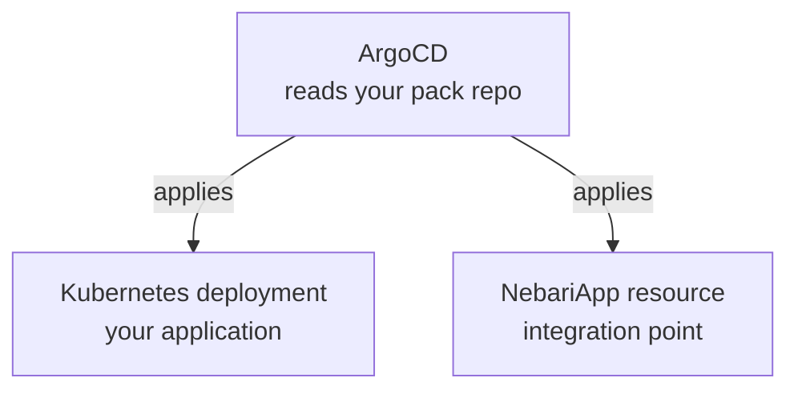

# Build your own pack

If a workload you'd like to run on Nebari isn't already in the catalog, you can package it as a Software Pack yourself.

## What's in a pack?

A pack is a Git repo with two pieces:

- **A Kubernetes deployment of your application:** Helm, Kustomize, or plain YAML are all first-class.
- **A `NebariApp` resource:** Tells the Nebari Operator to wire up routing, TLS, and authentication for your app.

Here's how ArgoCD turns your pack's two pieces into resources on the cluster:

## Start from the template

The easiest way to create a pack is to use the [Software Pack template](https://github.com/nebari-dev/nebari-software-pack-template).

To use the template:

1. Click "Use this template" on the template repository.
2. Clone your new repo.
3. Pick the example closest to your application.
4. Follow the instructions in the README to deploy your pack to a Nebari cluster.

## Private and internal packs

Packs can stay inside your organization. Put yours in a private GitHub repo, an internal Git host, or anywhere ArgoCD can reach. It works the same as a published pack, just without the public listing.
