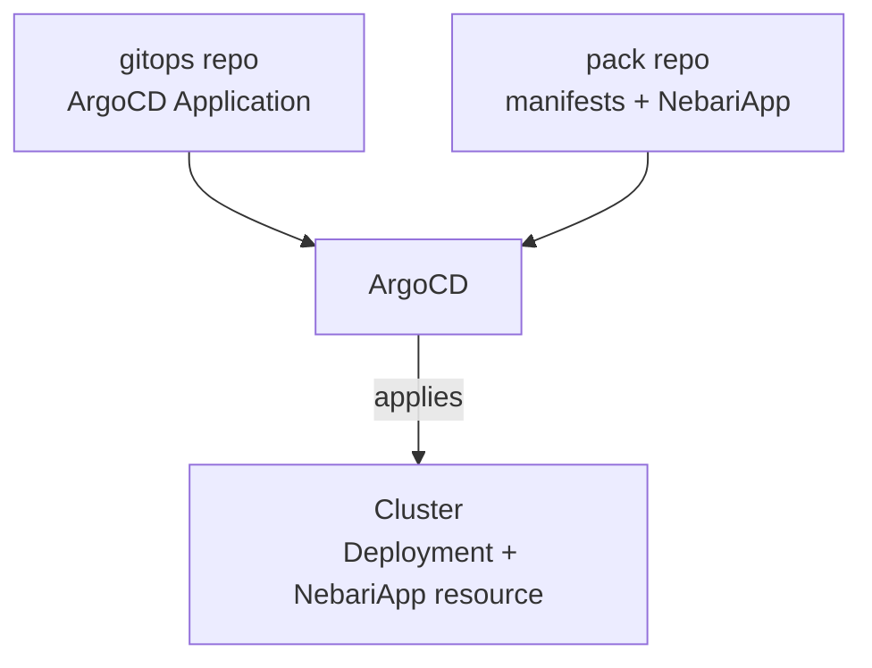

# Build your own pack

If a workload you'd like to run on Nebari isn't already in the catalog, you can package it as a Software Pack yourself.

## What's in a pack?

A software pack is a Kubernetes application bundled with a `NebariApp` custom resource. The Nebari Operator reads the `NebariApp` to wire up routing, TLS, and authentication for your app.

If your app already runs on Kubernetes (via Helm, Kustomize, or plain YAML), adding a `NebariApp` resource is all it takes.

## Start from the template

The easiest way to create a pack is to use the [Software Pack template](https://github.com/nebari-dev/nebari-software-pack-template).

To use the template:

1. Click "Use this template" on the template repository.
2. Clone your new repo.
3. Pick the example closest to your application.
4. Follow the instructions in the README to deploy your pack to a Nebari cluster.

## Deploying a pack

To deploy a pack, commit an **ArgoCD Application** to your gitops repo. This Application is a small YAML file that tells ArgoCD which pack to deploy and how to configure it. From there, ArgoCD:

- Reads the Application.
- Pulls in the pack.
- Applies the Application's values to the pack.
- Applies the resulting resources to the cluster.

## Private and internal packs

Packs can stay inside your organization. Put yours in a private GitHub repo, an internal Git host, or anywhere ArgoCD can reach. It works the same as a published pack, just without the public listing.
