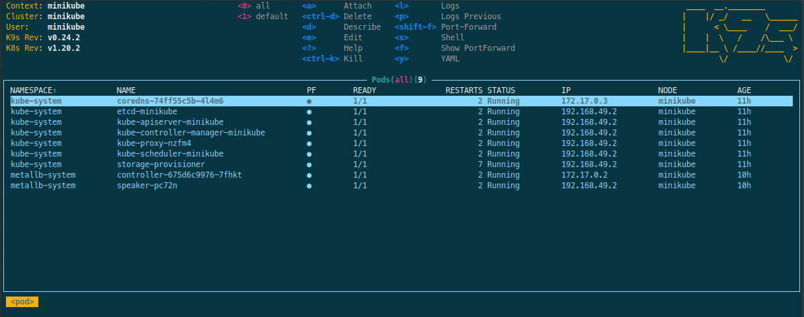

# Troubleshooting

Invariably you will encounter behavior that does not match your expectations.
This guide is meant to explain that behavior, give you some context around
why it's happening, help you diagnose it, and if possible resolve it.

## Configuration

### Required pins for Dask environments

There are some pins that are required for the Nebari Dask environment to function correctly.

The best way to manage dask pins is to use the `qhub-dask`
[metapackage on conda-forge](https://anaconda.org/conda-forge/qhub-dask).
Usage will look something like this:

```yaml
environments:
  environment-dask.yaml:
    name: dask
    channels:
    - conda-forge
    dependencies:
    - python
    - ipykernel
    - ipywidgets
    - qhub-dask ==0.2.3
```

The pins for the metapackage can be found in the [conda-forge recipe](https://github.com/conda-forge/qhub-dask-meta-feedstock/blob/master/recipe/meta.yaml).

## Errors

### Default Conda-Store environment fails to build on initial deployment

One of the two Conda-Store environments created during the initial Nebari deployment (`dashboard` or `dask`) may fail to appear as options when logged into JupyterHub.

If your user has access to Conda-Store, you can verify this by visiting `<your_nebari_domain>.com/conda-store` and having a look at the build status of the missing environment.

The reason for this issue is due to how these environments are simultaneously built. Under the hood, Conda-Store relies on Mamba/Conda to resolve and download the specific packages listed in the environment YAML. If both environment builds try to download the same package with different versions, the build that started first will have their package overwritten by the second build. This causes the first build to fail.

To resolve this issue, navigate to `<your_nebari_domain>.com/conda-store`, find the environment build that failed and trigger it to re-build.

### DNS domain={{ your_nebari_domain }} record does not exist

During your initial Nebari deployment, at the end of the `04-kubernetes-ingress` stage, you may receive an output message stating that the DNS record for `your_nebari_domain` "appears not to exist, has recently been updated, or has yet to fully propagate."

As the output message indicates, this is likely the result of the non-deterministic behavior of the DNS.

Without going into a deep dive of what DNS is or how it works, the issue encountered here is that when Nebari tries to look up the IP address associated with the DNS record, `your_nebari_domain`, nothing is returned. Unfortunately, this "lookup" is not as straightforward as it sounds. To lookup the correct IP associated with this domain, many intermediate servers (root, top level domain, and authoritative nameservers) are checked, each with their own cache, and each cache has its own update schedule (usually on the order of minutes, but not always).

As the output message mentions, it will ask if you want it to retry this DNS lookup again after another wait period; this wait period keeps increasing after each retry. However, it's possible that after waiting 15 or more minutes that the DNS still won't resolve.

At this point, feel free to cancel the deployment and rerun the same deployment command again in an hour or two. Although not guaranteed, it's likely that the DNS will resolve correctly after this prolonged wait period.

If you are interested in learning more about DNS, [see this interesting comic](https://howdns.works/).

## How do I...?

### Get kubernetes context

Depending on a variety of factors, `kubectl` may not be able to access your Kubernetes cluster. To configure this utility for access, depending on your cloud provider:

import Tabs from '@theme/Tabs';
import TabItem from '@theme/TabItem';

<Tabs>
  <TabItem value="gcp" label="Google Cloud" default>

[Google Cloud Platform](https://cloud.google.com/kubernetes-engine/docs/how-to/cluster-access-for-kubectl)

1. Download the [GCP SDK](https://cloud.google.com/sdk/downloads).
2. Authenticate with GCP: `gcloud init`
3. Run the following command: `gcloud container clusters get-credentials <project-name>-<namespace> --region <region>`

</TabItem>
<TabItem value="do" label="Digital Ocean">

[DigitalOcean](https://www.digitalocean.com/docs/kubernetes/how-to/connect-to-cluster/)

1. [Download the Digital Ocean command line utility](https://www.digitalocean.com/docs/apis-clis/doctl/how-to/install/).
2. If you haven't already, create a [Digital Ocean API token](https://www.digitalocean.com/docs/apis-clis/doctl/how-to/install/).
3. [Authenticate via the API token](https://www.digitalocean.com/docs/apis-clis/doctl/how-to/install/): `doctl auth init`
4. Run the following command: `doctl kubernetes cluster kubeconfig save "<project-name>-<namespace>"`

</TabItem>
<TabItem value="aws" label="Amazon AWS">

[Amazon Web Services](https://docs.aws.amazon.com/eks/latest/userguide/create-kubeconfig.html)

1. Download the [AWS CLI](https://aws.amazon.com/cli/).
2. If you haven't already, [create an AWS Access Key and Secret Key](https://aws.amazon.com/premiumsupport/knowledge-center/create-access-key/).
3. Run the following command: `aws eks --region <region-code> update-kubeconfig --name <project-name>-<namespace>`

</TabItem>
</Tabs>

After completing these steps according to your cloud provider, `kubectl` should be able to access your Kubernetes cluster.

### Debug the Kubernetes Cluster

If you need more information about your Kubernetes cluster, [`k9s`](https://k9scli.io/) is a terminal-based UI that is extremely useful for debugging. It simplifies navigating, observing, and managing your applications in Kubernetes. `k9s` continuously monitors Kubernetes clusters for changes and provides shortcut commands to interact with the observed resources. It's a fast way to review and resolve day-to-day issues in Kubernetes, a huge improvement to the general workflow, and a best-to-have tool for debugging your Kubernetes cluster sessions.

[Installation instructions for macOS, Windows, and Linux](https://github.com/derailed/k9s) are available.

By default, `k9s` starts with the standard directory that's set as the context (in this case Minikube). To view all the current process press 0:



> **NOTE**: In some circumstances, you will be confronted with the need to inspect any services launched by your cluster at your `localhost`. For instance, if your cluster has problem with the network traffic tunnel configuration, it may limit or block the user’s access to destination resources over the connection.

`k9s` port-forward option <kbd>shift</kbd> + <kbd>f</kbd> allows you to access and interact with internal Kubernetes cluster processes from your localhost you can then use this method to investigate issues and adjust your services locally without the need to expose them beforehand.

### Deploy an arbitrary pod

The simplest way to deploy arbitrary pods would be to use `kubectl apply` on the pod manifest.

### Upgrade the instance size for the `general` node group

The `general` node group, or node pool, is (usually) the node that hosts most of the pods that Nebari relies on for its core services: `hub`, `conda-store`, `proxy` and so on. We have attempted to "min-max" the instance size of the node: large enough so that the initial deployment will work out of the box, while keeping total cloud compute costs to a minimum.

Although each cloud provider has different names and hourly prices for their compute nodes, the default `general` node group in `qhub-config.yaml` has 2 vCPU and 8 GB of memory.

> Given the possible destructive nature of resizing this node group, we **highly recommend** backing up your cluster before attempting this.

Based on testing, clusters running on Google Kubernetes Engine (GKE) appear to be amenable to in-place upgrades of the `general` node instance size. Unfortunately, this does not seem to be the case with the other cloud providers, and attempting to do so for AWS and Azure will likely result in the catastrophic destruction of your cluster.

| Cloud Provider | `general` node upgrade possible? |
| :------------- | :------------------------------- |
| AWS            | No (Danger!)                     |
| Azure          | No (Danger!)                     |
| Digital Ocean  | No                               |
| GCP            | Yes                              |

If modifying the resource allocation for the `general` node in-place is absolutely necessary, try increasing the maximum number of nodes for the `general` node group. This will mean two nodes (reserved for the `general` node group) will always be running, ultimately increasing the operating cost of the cluster.

Alternatively, you can backup your cluster, destroy it, specify the new instance size in your `qhub-config.yaml`, and redeploy.

### Use a DNS provider other than CloudFlare

CloudFlare is one of the most commonly used DNS providers for Nebari, so to some it may seem as if it is the _only_ DNS provider Nebari supports. This is NOT the case! Please check out our "How to" documentation, paying particular attention to the domain registry section.

### Add system packages to a user's JupyterLab image

In some cases, you may wish to customize the default user's JupyterLab image, such as installing some system packages via apt (or other OS package manager) or adding some JupyterLab extensions.

Nebari uses its own registered docker images for `jupyterhub`, `dask`, and `jupyterlab` services by default, but this can be changed by:

1.  Building your own docker images, and
2.  Including the DockerHub register hash into `qhub-config.yaml`.

### Provide individual users with unique environments and cloud instance types

Nebari allows for admins to set up user groups which each have access to specific environments and server instance types. This allows for a fine-tuned management of your cloud resources. For example, you can create a special user group for a team of ML engineers which provides access to GPUs and a PyTorch environment. This will prevent inexperienced users from accidentally consuming expensive resources. Provided you have performed some setup ahead of time, users can choose both instance types as well as environments at server launch time.

First, you will need to create new node groups, one for each type of GPU instance you would like to provide users.

Second, you will need to create a new JupyterLab profile to select the GPU node. In this way, you'll have a separate profile for GPUs which users can select.
