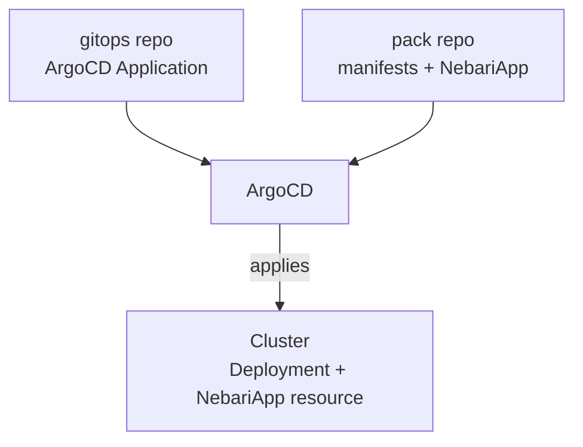

If a workload you'd like to run on Nebari isn't already in the catalog, you can package it as a Software Pack yourself.

## What's in a pack?

A software pack is a Kubernetes application bundled with a `NebariApp` custom resource. The Nebari Operator reads the `NebariApp` to wire up routing, TLS, and authentication for your app.

To start building a pack:

- **From an existing Helm chart:** follow [Add the NebariApp to a Helm chart](#add-the-nebariapp-to-a-helm-chart).
- **From scratch:** follow [Start from the template](#start-from-the-template).

## Add the NebariApp to a Helm chart

If your app already has a Helm chart, adding a `NebariApp` resource is all it takes. To add it, use the official [`nebari-app` library chart](https://github.com/nebari-dev/nebari-operator/tree/main/charts/nebari-app):

1. Add it as a dependency in `Chart.yaml`, then run `helm dependency build`. The library chart needs Helm 3.17.0 or later:

   ```yaml
   dependencies:
     - name: nebari-app
       repository: oci://quay.io/nebari/charts
       version: ">=0.1.1"
   ```

2. Set any `NebariApp` `spec` field under `nebariapp:` in `values.yaml`. Replace `my-pack` with your chart's name:

   ```yaml
   nebariapp:
     enabled: false
     hostname: '{{ fail "nebariapp.hostname is required when nebariapp.enabled is true" }}'
     service:
       name: '{{ include "my-pack.fullname" . | toJson }}'
       port: '{{ .Values.service.port }}'
     routing:
       routes:
         - pathPrefix: /
   ```

3. Render it in `templates/nebariapp.yaml`. The `if` makes the `NebariApp` optional, so the chart works both standalone and on Nebari:

   ```yaml
   {{- if .Values.nebariapp.enabled }}
   {{- include "nebari-app.nebariApp" (dict
       "metadata" (dict
         "name"      (include "my-pack.fullname" .)
         "namespace" .Release.Namespace
         "labels"    (include "my-pack.labels" . | fromYaml)
       )
       "spec"   (omit .Values.nebariapp "enabled")
       "tplCtx" .
   ) -}}
   {{- end }}
   ```

When a `{{ ... }}` value renders a string, add `| toJson` at the end. It wraps the string in quotes so it's valid JSON:

```yaml
name: '{{ include "my-pack.fullname" . | toJson }}'   # works
name: '{{ include "my-pack.fullname" . }}'            # fails to render
```

## Start from the template

If you're building a pack from scratch, start from the [Software Pack template](https://github.com/nebari-dev/software-pack-template).

To use the template:

1. Click "Use this template" on the template repository.
2. Clone your new repo.
3. Pick the example closest to your application.
4. Follow the instructions in the README to deploy your pack to a Nebari cluster.

## Deploying a pack

To deploy a pack, commit an **ArgoCD Application** to your gitops repo. This Application is a small YAML file that tells ArgoCD which pack to deploy and how to configure it. From there, ArgoCD:

- Reads the Application.
- Pulls in the pack.
- Applies the Application's values to the pack.
- Applies the resulting resources to the cluster.



## Private and internal packs

Packs can stay inside your organization. Put yours in a private GitHub repo, an internal Git host, or anywhere ArgoCD can reach. It works the same as a published pack, just without the public listing.
