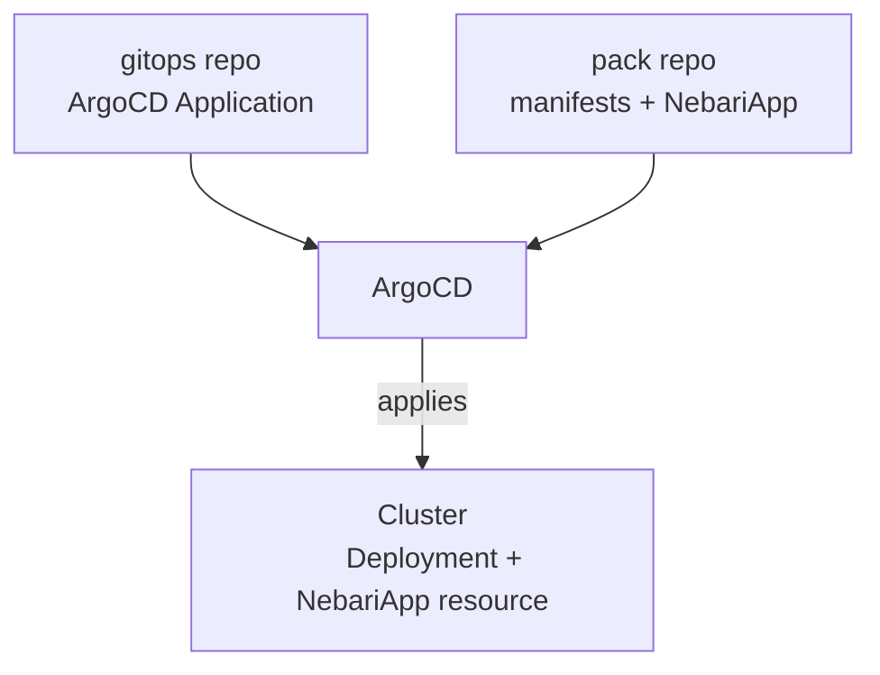

To deploy a pack, commit an **ArgoCD Application** to your gitops repo. This Application is a small YAML file that tells ArgoCD which pack to deploy and how to configure it. From there, ArgoCD:

- Reads the Application.
- Pulls in the pack.
- Applies the Application's values to the pack.
- Applies the resulting resources to the cluster.

